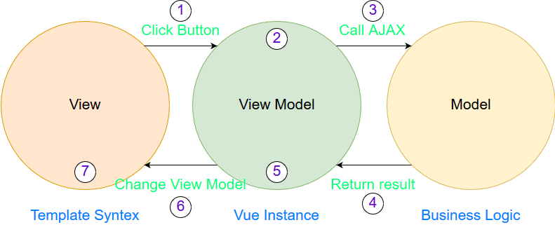

# 初探 Vue.js

## 基本原理

Vue.js 是處理 View Layer 的 Library ，使用 Vue.js 時，我們會操作 View Model (也就是 Vue.js 的實體)使其依照從商業邏輯取得的資料做改變，配合在 HTML 中 Vue.js 提供的模板語法來改變配置，重新渲染後使畫面產生變化。

下圖是一個 Vue.js 簡單的架構圖:



* View : 透過 HTML 及模板語法渲染出來的畫面。
* View Model : 使用 Vue.js 所建立起來的實體。
* Model : 後端程式中的商業邏輯。

圖中的綠色文字代表範例情境:

1. 使用者按下按鈕。
1. 透過 HTML 中模板語法的綁定觸發 Vue 實體中註冊的事件。
1. 事件中叫用 AJAX 向伺服器請求資料。
1. 伺服器取得資料後傳回給 Vue 實體。
1. Vue 實體修改綁定的 View Model 。
1. View Model 改變後觸發模板重新渲染。
1. 使用者看到改變後的畫面。

上述的情境是在高層次的面上做說明，實際上 Vue.js 的運作原理還要比這個深奧許多，後面有機會再來分享，現在這階段，用這樣的架構去說明就可以有比較具體的概念了。

>如果以語言來分的話， View 就是 HTML ， View Model 是 JS ，而 Model 就是像 Node 、 Java 這類的後端語言。

## 第一支 Vue.js

這一節會用上節的情境來開發一個簡單的 Vue.js 應用，讓我們對 Vue.js 的流程有個初步的了解。

首先要建立一個 Vue 實體，再來在 HTML 中編寫模板語法，之後將 HTML 上欲做變化的元素登錄在 Vue 實體中，接著綁定 Click 事件至後端取得資料，最後修改 Vue 實體中的資料藉以讓畫面產生變化。

### 引入 Vue.js 庫

引入 Vue 的方式有很多種，在一般的專案中通常都是使用 Webpack 來引入，但本系列文為了 Demo 方便，使用 `<script>` 元素來引入。

```html
<!DOCTYPE html>
<html>
<head>
    ...
    <script src="https://unpkg.com/vue"></script>
</head>
<body>
    ...
</body>
</html>
```

這樣就引入了 Vue.js 庫了。

> Vue.js 有分不同的版本: **Full** 及 **Runtime-only** ， Runtime-only 版本比 Full 少了 Compiler ，這是將模板編譯成 render function 的編譯器，因此如果只使用 Render Function 來渲染頁面的話可以只載入 Runtime-only 就好，在後面的章節會介紹 Render Function，那時候會做比較詳細的說明，而版本差別的詳細說明可以參考[官網的介紹](https://vuejs.org/v2/guide/installation.html#Runtime-Compiler-vs-Runtime-only)。

### 建立 Vue 實體

接下來要建立 Vue 實體，就是上圖中間圓圈的部分， Vue 實體是整個 Vue.js 應用必備的物件，要建立 Vue 實體很簡單，如下程式碼:

```html
<!DOCTYPE html>
<html>
<head>
    ...
    <script src="https://unpkg.com/vue"></script>
</head>
<body>
    ...
    <script>
        var vm = new Vue({
            ...
        });
        ...
    </script>
</body>
</html>
```

`<script>` 中的 `new Vue({...})` 會建立 Vue 的實體，而 vm 變數取得的就是 Vue 實例化的物件。

> 通常 Vue 實例化物件會以 vm 當作其變數名稱，這也呼應了上面介紹: Vue 實例化物件在架構上代表著 View Model 層。

Vue 的第一個參數是 [Options](https://vuejs.org/v2/api/index.html#Options-Data)，它用來登錄 Vue 實體所需的對象。

以這個例子來說有三個部分需要設定:

* 註冊一個 Vue 實例的掛載目標。
* 需要一個輸出取得結果的資料。
* 一個向後端取得資料的 Click 事件。

所以 `Options` 物件會像下面這樣:

```js
var vm = new Vue({
    el: '#app',
    data: {
        message: "This is local data.",
    },
    methods: {
        getRemoteMessage() {
            Promise.resolve("Get remote data.")
                .then((res) => {
                    this.message = res;
                });
        },
    },
});
```

* `el` : 將這個 Vue 實體掛載到這裡設置的元素上。
* `data` : 登錄資料，當這些資料改變時，畫面會依照變化做改變。
* `methods` : 登錄方法，這些方法可以藉由 DOM 事件觸發，也可以在 Vue 實例中被叫用。

上面的程式碼做了下面三件事:

* 將頁面上 ID 為 `app` 的元素當作這個 Vue 實例的掛載目標。
* 初始一個 `message` 的畫面響應資料。
* 定義一個 `getRemoteMessage` 方法，該方法會以非同步的方式取得資料，然後將取得的資料設置於 `message` 上。

> 這裡直接使用 Promise.resolve 當作範例，實際上這裡可以用 AJAX 取得資料。

這樣就把 Vue 實例建立起來了。

### 編寫模板

最後要使用 Vue 提供的模板語法來綁定 Vue 實例中的物件，我們需要下面這些部分:

* 一個 ID 為 `app` 的 `<div>` 。
* 一個顯示訊息的 `<p>` 。
* 一顆取回非同步資料的 `<button>` 。

配置會像下面這樣:

```html
<!DOCTYPE html>
<html>
<head>
    ...
    <script src="https://unpkg.com/vue"></script>
</head>
<body>
    <div id="app">
        <p>{{message}}</p>
        <button v-on:click="getRemoteMessage">Click</button>
    </div>
    ...
</body>
</html>
```

這裡有兩個 Vue 的模板語法:

* `{{message}}` : 綁定 Vue 實例中的 `message` 資料。
* `v-on:click` : 綁定 Vue 實例中的 `getRemoteMessage` 方法至 Click 事件中。

如此一來我們就完成了所有的配置，當你按下按鈕後就會看到 `This is local data`. 變為 `Get remote data.` 了。

## 再進一步

上面完成了我們第一個 Vue 的應用程式，但如果現在的情境是 **舊系統裡面要使用 Vue.js 來擴充功能** 呢? 例如說取得資料的按鈕並不存在於 Vue 實體中，那要怎麼辦呢?

我們假設以下是我們目前的頁面配置:

```html
<div id="app">
    <p>{{message}}</p>
    ...
</div>
<button ...>Outside Button</button>
```

因為按鈕在 Vue 實例(`div#app`)的範圍外，並不在 Vue 模板中，所以並不能使用像是 `v-on:click` 這樣的模板語法綁定事件。

這裡可以使用 `vm` 變數， `vm` 變數就是 Vue 實例的物件，因此修改 `vm` 中的 `message` 也可以達到同樣的效果:

```html
<div id="app">
    <p>{{message}}</p>
    ...
</div>
<button onclick="clickButton()">Outside Button</button>
<script>
    var vm = new Vue({
        el: '#app',
        data: {
            message: "This is local data.",
        },
        ...
    });

    function clickButton() {
        Promise.resolve("Get remote data by outside button.")
            .then((res) => {
                vm.message = res;
            });
    }
</script>
```

這樣就算系統中其他部分不是使用 Vue.js ，也可以很輕鬆的整合。

## 完整程式碼

以下是完整的程式碼，包含了 Vue 實例內及實例外的按鈕範例。

```html
<!DOCTYPE html>
<html>
<head>
    <title>Hello Vue.js</title>
    <script src="https://unpkg.com/vue"></script>
</head>
<body>
    <!-- 7. Output View after rerender -->
    <div id="app">
        <p>{{message}}</p>  <!-- 6. Rerender View -->
        <button v-on:click="getRemoteMessage">Inside Button</button>   <!-- 1. Click Button -->
    </div>
    <button onclick="clickButton()">Outside Button</button>   <!-- 1. Click Button -->
    <script>
        var vm = new Vue({
            el: '#app',
            data: {
                message: "This is local data.",
            },
            methods: {
                getRemoteMessage() {    // 2. trigger event in Vue instance
                    Promise.resolve("Get remote data by inside button.") // 3. Get data asynchronously
                        .then((res) => {    // 4. Return result
                            this.message = res; // 5. Change View Model
                        });
                },
            },
        });

        function clickButton() {    // 2. trigger event in Vue instance
            Promise.resolve("Get remote data by outside button.") // 3. Get data asynchronously
                .then((res) => {    // 4. Return result
                    vm.message = res; // 5. Change View Model
                });
        }
    </script>
</body>
</html>
```

> 註解可以搭配文章一開始圖片上的數字做比較具體的理解。

## Demo

* [CodePen](https://codepen.io/peterhpchen/pen/vVXwOZ)

## 程式碼

* [GitHub](demo/02_FirstVue/index.html)

## 小結

Vue.js 只要單純的設置就能改變頁面的配置，在範例中我們並沒有修改 DOM 元素，而是專注在對 View Model 做改變，由於不用直接接觸頁面的配置，因此變換邏輯跟頁面沒有直接的關係，所以就算修改了頁面的配置，只要模板語法的設定正確，不需要修改邏輯就可以完成修改，這樣的特性使頁面可以更容易的被抽換。

例如我們今天想要修改 `message` 的 `<p>` 為 `<div>` ，如果是 JQuery 的寫法，除了 HTML 的配置要做修改外，還必須要修改 JavaScript 的程式碼，可是在 Vue.js 中我們只要把 `<p>` 改為 `<div>` 就好，只要 View Model 依然是 `message` ，我們就不需要修改任何的 JavaScript 碼。

而對於舊系統的相容也可以用 `vm` 變數做到對 Vue 實例的修改，在整合原有專案上有很大的優勢。

## 參考資料

* [Vue.js Guide : Installation](https://vuejs.org/v2/guide/installation.html)
* [Vue.js Guide : Introduction](https://vuejs.org/v2/guide/index.html)
* [Vue.js Guide : The Vue Instance](https://vuejs.org/v2/guide/instance.html)
* [Vue.js API](https://vuejs.org/v2/api/)