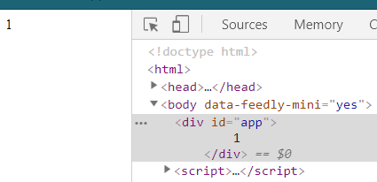

# Vue 實例

每一個 Vue 的應用都一定有 Vue 實例(Instance)，建立實例後，搭配模板語法或是渲染函式，我們可以透過改變實例的物件來操作頁面的配置，因此在使用 Vue.js 前，對於 Vue 實例一定要有基礎的認識。

## Vue 應用程式組成

整個 Vue 應用程式都會從一個根(Root) Vue 實例開始，這個 Vue 實例會用 `new Vue({/* Options */})` 建立，而根實例的下面可以引入各種可以重複使用的組件(Component)，每個組件都是一個 Vue 實例，因此整個應用程式會是一個以根實例為起始所展開的組件樹(component tree)，以 ToDo 應用來看會像是下面這樣:

```
Root Instance
└─ TodoList
   ├─ TodoItem
   │  ├─ DeleteTodoButton
   │  └─ EditTodoButton
   └─ TodoListFooter
      ├─ ClearTodosButton
      └─ TodoListStatistics
```

> 引用至 [Vue.js 官方指南](https://vuejs.org/v2/guide/instance.html#Creating-a-Vue-Instance)

而頁面配置會像是下面這樣:

```html
<!-- Root Instance-->
<div id="root">
    <TodoList />
</div>

<!-- TodoList -->
<div class="todo-list">
    <TodoItem v-for="item in items" />
    <TodoListFooter />
</div>

<!-- TodoItem -->
<div class="todo-item">
    <DeleteTodoButton />
    <EditTodoButton />
</div>

<!-- ... -->
```

上面可以看到組件會以客製的 HTML 標籤配置在頁面上，並且組件裡可以配置組件，同時也可以重複使用(v-for 語法可以依照傳入的陣列渲染出多個相同架構的 HTML 標籤)。

這樣的設計讓開發者可以重複使用相同功能的組件，減少重複的 HTML 配置以及 JavaScript 中控制頁面的代碼，增加了開發的便利性。

## 實例內的選項

下面是一個簡單的根實例代碼:

```js
var vm = new Vue(
    // Options
    {
        el: "#app",
        data: {
            a: 1
        },
    }
);
```

```html
<div id="app">
    {{a}}
</div>
```

Vue 只有一個參數: Options ，這個參數是一個物件，設定這實例的定義，在上面的例子設定了兩個屬性: el 及 data 。

* el : 根實例的掛載目標，使用 css selector 指到頁面上的元素，藉此將元素編譯成 Vue 的模板(template)。
* data : 實例中所有響應的目標，如果沒有設置在此屬性內的目標將不會觸發頁面的重新渲染。

上面的代碼中，我們利用 el 屬性將 id 為 app 的 HTML 元素渲染為 Vue 的模板，因此在這元素的範圍內可以使用 Vue 的模板語法(例如: {{}})，而 data 的設定讓 a 的任何改變可以連動至畫面上，因此我們看到的畫面會被渲染為下面這樣:



經過了 Vue 的處理，原本的頁面依照 Options 上的定義產生了變化。

> Vue.js 的 API 有提供各種不同的[選項](https://vuejs.org/v2/api/#Options-Data)，之後的篇章會詳細講解它們的功用，這裡先用簡單的例子說明。

雖然 Vue 實例上的 Options 每個都有自己的設定方式，但大部分都大同小異，這裡就以 Vue 應用最基本的兩個步驟: 綁定元素及改變畫面講起吧。

## 綁定元素

上面有提到 el 的設置可以讓 Vue 知道頁面上的哪個部分要當作 Vue 實例的模板，而讓知道掛載目標後，Vue 設置模板的方式有三種:

1. 選項中有設置 template 時，使用 template 中的 html 取代原本元素上的配置:

```js
var vm2 = new Vue(
    // Options
    {
        el: "#app2",
        template: '<div class="template">template: {{a}}</div>',
        data: {
            a: 1
        },
    }
);
```

2. 選項中有設置 render 函式時，使用 render function 配置模板:

```js
var vm3 = new Vue(
    // Options
    {
        el: "#app3",
        render(h) {
            return h(
                'div',
                {
                    'class': {
                        render: true
                    }
                },
                `render: ${this.a}`
            )
        },
        data: {
            a: 1
        },
    }
);
```

> render function 是屬於進階的用法，這裡知道有這樣的方式就好。

3. 選項中沒有設置 template 屬性，也沒有設置 render 函式時，使用原本頁面上的元素配置(同上節的例子)。

> 在 template 屬性及 render 函式的配置下，原本元素的內容會被覆蓋，如果還想要繼續使用元素內的內容的話，可以使用 [Slots](https://vuejs.org/v2/guide/components-slots.html) ，後面的章節會詳細提到。

上面就是綁定元素的方式，可以看到所有的方式都是在選項的定義上完成的，而定義可以是變數也可以是函式。

下面是這三個綁定方式的 Demo :

<p data-height="265" data-theme-id="0" data-slug-hash="qJVpwR" data-default-tab="js,result" data-user="peterhpchen" data-pen-title="Bind Element" class="codepen">See the Pen <a href="https://codepen.io/peterhpchen/pen/qJVpwR/">Bind Element</a> by Peter Chen (<a href="https://codepen.io/peterhpchen">@peterhpchen</a>) on <a href="https://codepen.io">CodePen</a>.</p>
<script async src="https://static.codepen.io/assets/embed/ei.js"></script>

## 改變畫面

使用前端框架的目的都是要簡化改變畫面的工作，在 JQuery 中，我們使用 CSS Selector 取得想要改變的元素，再改變元素中的屬性來變化頁面。

而在 Vue.js 中，我們會對實例中的 data 做修改使畫面產生變化。

data 可以從實例中的 $data 取得:

```js
var vm = new Vue({
  ...
  data: {
    a: 1
  }
});

console.log(vm.$data.a); // 1
```

> 像是 $data 這種有前綴 $ 的屬性是 Vue 實例所配置的，有前綴是為了跟使用者定義的屬性作區別，所有的 $ 屬性可以在 [API 文件](https://vuejs.org/v2/api/#Instance-Properties)中找到。

直接對修改 $data ， Vue 就會重新渲染畫面造成變化:

```js
vm.$data.a = 2; // equal to vm.a = 2
```

> Vue 實體會將選項定義的常用屬性提升到實體的最上層中，像是剛剛提到的 data ，或是 computed 、 methods 等等，所以對 `vm.a` 做修改也會有一樣的效果。

在選項內的 function 中的 this 就是 vue 實例，所以當要在 methods 裡使用 data 的話只要像下面這樣:

```js
var vm = new Vue({
  ...
  data: {
    a: 1
  },
  methods: {
    add() {
      this.a += 1;
    }
  }
});
```

> 注意: 這裡不能使用箭頭函式(arrow funcitons)，因為箭頭函式的 this 會綁定上層(父親)的內容，不會是 Vue 的實例，導致使用 this 的時候產生問題。

下面是改變畫面的 Demo:

<p data-height="265" data-theme-id="0" data-slug-hash="LgONJB" data-default-tab="js,result" data-user="peterhpchen" data-pen-title="Change Data" class="codepen">See the Pen <a href="https://codepen.io/peterhpchen/pen/LgONJB/">Change Data</a> by Peter Chen (<a href="https://codepen.io/peterhpchen">@peterhpchen</a>) on <a href="https://codepen.io">CodePen</a>.</p>
<script async src="https://static.codepen.io/assets/embed/ei.js"></script>

## 程式碼

* [GitHub]()

## 總結

從大層面的地方看， Vue 應用程式是由多個 Vue 實體所建立的，Root 實體( new Vue() )只能有一個，而它的下面可以引用無數個不同且可重複的元件實體。

從小的地方來說， Vue 實體的配置都是需要經由定義選項物件來完成，透過 el 及 data 當作例子，講解選項物件中可以使用屬性及函式來定義各個不同的物件，Vue 實體就會依照這些定義掛載目標元素及改變畫面的方式。

## 參考資料

* [Vue.js API](https://vuejs.org/v2/api/)
* [Vue.js Guide : The Vue Instance](https://vuejs.org/v2/guide/instance.html)
* [Vue.js Guide : Render Functions & JSX](https://vuejs.org/v2/guide/render-function.html)
* [SCOTCH : Components and the Vue Instance](https://scotch.io/courses/build-an-online-shop-with-vue/components-and-the-vue-instance)