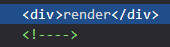

# 模板語法 Part 2 - Directives

前一章談到了 Mustache 標籤: 可以把實體的資料響應在頁面上的 `{{}}` ，這次來看看另一個語法 Directives 。

## 介紹

Directive 使用起來像是 HTML 的 Attributes ，相較於 Mustache 標籤只是單純的取代頁面上的區塊， Directives 的設定會影響 DOM 本身，使 DOM 元素因響應造成 Attributes 或是渲染上的變化。

### 擺放位置

Directives 的配置會像是 DOM 元素標籤中的 `name` 、 `id` 、 `class` ... 等，跟 `{{}}` 放在 DOM 元素下層的方式不同， Directives 是放在元素中:

```html
<div id="app">
  {{a}} <!-- under the #app -->
  <button v-on:click="a++">+</button> <!-- inside of the button tag -->
</div>
```

上面的例子中 `v-on` 就是個 Directives ， `v-on` 的功能是可以把 Vue 實體中的 Methods 或是 JavaScript 陳述式使用在某個事件上。

* `{{a}}` : 直接在 `<div id="app">` 中，當作 `<div id="app">` `innerHTML` 的一部分。
* `v-on:click="a++"` : 在 `<button>` 內，當作 `<button>` 的 Attributes 。

### 命名

Directives 的名稱為了跟一般的 Attribues 作區別，都會以 `v-` 為前綴字，上節的 `v-on` 或是前一篇文章說到的 `v-once` 都是 Directives 。

### 數值

Directives 的數值跟 Mustache 相同是一個 JavaScript 的陳述式( `v-for` 的語法較為特別，之後的章節會介紹)，同樣可以用 `return [expression]` 的方式驗證正確性。

## 功能

Directives 可以使頁面渲染的方式依照相關的設置改變，像是 `v-if` 決定是否渲染元素、 `v-for` 重複渲染相同元素...等，也可以當作 Attributes 的值，像是 `v-bind` 、`v-on` 綁定屬性及事件，接下來會簡介幾個不同功能的 Directives ，從中介紹相關的特性。

### 將實體中的資料當作 HTML 渲染

`v-html` 會將資料當作 HTML 做渲染:

```js
var vm = new Vue({
  ...
  data: {
    ...
    html: '<h1>I am header</h1>'
  }
});
```

```html
<div id="app">
  ...
  <div>{{html}}</div>
  <div v-html="html"></div>
</div>
```

* `{{html}}` : Mustache 標籤會將 `html` 資料當作字串輸出。
* `v-html="html"` : 它會將 `html` 資料設置給此元素( `<div>` )的 `innerHTML`，所以渲染完成的頁面會是 `<div><h1>I am header</h1></div>` 。

> `v-html` 中設置的 HTML 是直接設置在 HTML 上，不會經過編譯器，所以不能設置 Vue 的模板語法。

> Vue 其實不鼓勵直接改變 HTML ，如果使用到 v-html 可以想想是否可以包成 [Components](https://vuejs.org/v2/guide/components.html) 。

### 以變數決定是否要渲染元素

可以使用 `v-if` 來決定是否要渲染元素:

```html
<div id="app">
  ...
  <div v-if="condition">render</div>
  <div v-if="!condition">never render</div>
</div>
```

`condtion` 為 `true` 的情況下，渲染結果如下:



`v-if` 為 `false` 的元素會變為 <!----> 而不會渲染出來。

### 綁定 Attributes

假設要依照資料綁定到 DOM 的 Attributes 上，學過上一章的 Mustache 標籤，大家可能會想要像下面這樣寫:

```html
<div id="app">
  ...
  <div id="{{id}}">Mustache</div>
</div>
```

這其實是錯誤的，它會被當作一般的字串渲染出來(像是這樣: `<div id="{{id}}">Mustache</div>` )，這是因為只要不是 Vue 的 Directives ，其他的都會被 Vue 所忽略，所以要綁定像是 `name` 、 `id` 等的元素 Attributes ，需要使用 `v-bind` :

```html
<div id="app">
  ...
  <div v-bind:id="id">Bind Directives</div>
</div>
```

看到 `v-bind` ， Vue 就會知道這個 Attribute 要抓取實體上的 `id` 做渲染。

這裡要注意的是如果綁定的值是布林值的話，如果是 `null` 、 `undefined` 或是 `false` 的話，此 Attribute 就不會被渲染出來，如下的例子:

```html
<div id="app">
  ...
  <button v-bind:disabled='isDisabled'>I am disabled</button>
</div>
```

如果 `isDisabled` 是 `false` 的話，按鈕會被渲染成:

```html
<button>I am disabled</button>
```

### 綁定事件

當要在 `<button>` 或是其他元素上綁定事件時，我們會使用 `v-on` 來綁定，看一個常見的例子:

```js
var vm = new Vue({
  ...
  data: {
    b: 10000,
    ...
  },
  methods: {
    click() {
      this.b--;
    }
  }
});
```

```html
<div id="app">
  ...
  <div>
    <span>{{b}}</span>
    <button v-on:click.once='click'>b--</button>
  </div>
</div>
```

這裡 `v-on:click.once` 綁定了實體中的 `click` 方法，所以按下按鈕後， `b` 會減一，但是後面加了 `once` 這個修飾符，代表這個事件只能被叫用一次，所以減了一次之後就不會在叫用此事件了。

## 配置方式

上面的例子中我們看到了幾個不同的配置方式:


每個 Directives 的配置會有所不同，從最簡單只有 **Directive** 本身到加上 Argument 及 Modifier 的 **Directive:Argument.Modifier="Value"** 都有，下面會一一介紹。

### Directive

將此 Directive 作用在元素上，像是 `v-once` 是將**只渲染一次**的效果作用在元素上。

### Directive="Value"

依照 Value 將此 Directive 的效果作用在元素上，像是 `v-html="html"` 是將 `html` 的值寫入 `innerHTML` 。

### Directive:Argument="Value"

依照 Value 將此 Directive 作用在 Argument 上，例如 `v-bind:id="id"` 是將 `id` 的值綁定到 `id` Attribute 上。

### Directive:Argument.Modifier="Value"

依照 Value 將此 Directive 依照 Modifier 設定的特殊方式作用在 Argument 上，像是 `v-on:click.once="click"` 是將實體中的 `click` 事件依照**只作用一次**的條件綁定到元素的 `click` 事件上。

## 縮寫

在撰寫模板的時候，我們會需要大量的使用 `v-bind` 及 `v-on` 來綁定 Attribute 及事件，因此 Vue 給這兩個 Directives 縮寫，以減少開發上要寫的代碼數量。

### v-bind 的縮寫

```html
<!-- 一般寫法 -->
<button v-bind:disabled='isDisabled'>I am disabled</button>

<!-- 簡寫 -->
<button :disabled='isDisabled'>I am disabled</button>
```

`v-bind` 使用 `:` 當作簡寫。

### v-on 的縮寫

```html
<!-- 一般寫法 -->
<button v-on:click.once='click'>b--</button>

<!-- 簡寫 -->
<button @click.once='click'>b--</button>
```

`v-on` 使用 `@` 當作簡寫。

## 小結

這一章剛開始先介紹 Directives 它的功用以及如何設置，再來用不同的範例演示在不同情況下要使用的 Directives 有哪些，接著在統整出它的配置方式，使我們對 Directives 有個通盤的了解，最後介紹 Vue 為了開發者方便而釋出的縮寫方法。

## 模板語法總結

從昨天介紹的 Mustache 到今天的 Directive ，模板語法跳脫不了這兩個東西，可是 Directives 的種類繁多，在這兩章我們學會配置後，後面的篇章會以不同功用的語法分章節做細部的講解。

## 參考資料

* [Vue.js Template Syntax](https://vuejs.org/v2/guide/syntax.html)
* [Vue.js API](https://vuejs.org/v2/api/#Directives)