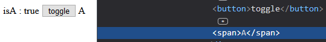
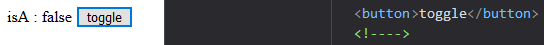
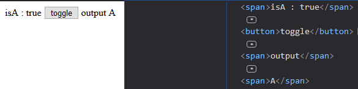
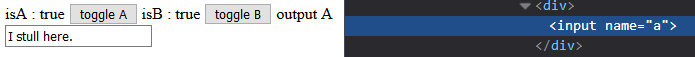
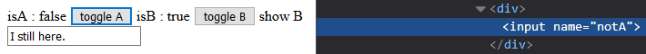

# 條件渲染

本文會介紹可以依照條件變化改變渲染元素的 Directives ，分別是以 `v-if` 、 `v-else-if` 及 `v-else` 為一組的條件渲染 Directives ，以及 `v-show` 這個控制是否顯示元素的 Directive，接下來依序看看這些 Directives 的用途。

## v-if

設定 `v-if` 的元素會依照其 `Value` 是否為 [Truthy](https://developer.mozilla.org/zh-CN/docs/Glossary/Truthy) 來決定是否要渲染此元素。

接著以例子做說明:

```js
var vm = new Vue({
  data: {
    isA: true
  }
});
```

宣告一個 `isA` 的判斷值。

```html
<button @click="isA = !isA">toggle</button>
<span v-if="isA">A</span>
```

模板上設置:

* `toggle` 按鈕: 按下按鈕反轉 `isA` 的值，使 `v-if` 的判斷符合/不符合。
* `v-if` : 用 `isA` 的值決定是否要顯示 `A` 字元。

結果如下截圖所示:



當 `isA` 是 `true` 的時候， `<span>A</span>` 是有渲染在頁面上的，接著我們看看 `isA` 變為 `false` 後頁面會如何變化:



在頁面上原本 `<span>A</span>` 的位置變為 `<!---->` ，由此可知當 `v-if` 的判斷不符合時，此元素不會被渲染在頁面上。

### 分組判斷

在前面 `v-if` 會需要綁定在一個元素上，那如果同時有多個元素要用此判斷式來決定是否渲染時該怎麼做呢?

我們可以像下面這樣用多個 `v-if` 掛在不同的元素上:

```html
<span v-if="isA">output</span>
<span v-if="isA">A</span>
```

但這樣的方式當需要做修改時，會需要修改多個地方，並不方便，為此 vue.js 提供了一個 `<template>` 標籤，這個標籤在渲染後並不會影響頁面的結構，但能在這個標籤上面使用部分的 Directives 來幫忙開發者分組設定相同的渲染效果。

以上面的例子改為 `<template>` 的方式實作後，模板如下:

```html
<template v-if="isA">
  <span>output</span>
  <span>A</span>
</template>
```

來看看渲染的結果:



可以看到 `v-if` 的功能運作正常，且 `<template>` 不會出現在渲染的結果上，因此不必擔心它影響元素的配置。

## v-else-if 及 v-else

vue 貼心的提供了像是代碼一樣的判斷方式，可以使用 `v-else-if` (像是 js 中的 `else if`) 以及 `v-else` (像是 js 中的 `else` ) 來設定更複雜的判斷。

下面是一個 v-else 的例子:

```html
<template v-if="isA">
  <span>output</span>
  <span>A</span>
</template>
<span v-else>not A</span>
```

如果 `isA` 不為真，則輸出 `<span>not A</span>` 。

在使用 `v-else` 的時候有兩點注意:

* `v-else` 沒有 `Value` ，它是一個單純的 Directive。
* `v-else` 設置元素必須緊跟在 `v-if` 或是 `v-else-if` 設置元素之後，而且必須是同一層的元素。

接著我們加上 `v-else-if` 來看看:

```html
<span>isA : {{isA}}</span>
<button @click="isA = !isA">toggle A</button>
<span>isB : {{isB}}</span>
<button @click="isB = !isB">toggle B</button>
<template v-if="isA">
  <span>output</span>
  <span>A</span>
</template>
<span v-else-if="isB">show B</span>
<span v-else>not A and B</span>
```

這裡多加了一個 `isB` 的資料，判斷如下:

1. 如果 `isA` 為真，則渲染 `<span>output</span><span>A</span>` 。
1. 如果 `isA` 不為真的話，則會判斷 `isB` 來決定是否要渲染 `<span>show B</span>` 。
1. 如果 `isA` 跟 `isB` 都不為真，則輸出 `<span>not A and B</span>` 。

`v-else-if` 有兩點在使用上需要注意:

* `v-else-if` 可以使用多次，如下面這樣配置:

```html
<span v-if="isA">A</span>
<span v-else-if="isB">B</span>
<span v-else-if="isC">C</span>
<!-- n 個 v-else-if -->
<span v-else-if="isZ">Z</span>
<span v-else>nothing output</span>
```

* `v-else-if` 跟 `v-else` 相同必須緊跟在 `v-if` 或是 `v-else-if` 設置元素之後，而且必須是同一層的元素。

## 條件渲染中的 key 屬性

vue 的條件渲染非常的聰明，它會去判斷條件改變前及改變後的元素配置是否相同，如果是相同的結構則會繼續沿用原本的 DOM 元素，並不會重新渲染，用這個方法減少重渲染所需的花費，提高效能。

下面的例子可以看出 vue 重複使用原本的 DOM 元素:

```html
<input v-if="isA" name="a">
<input v-else name="notA">
```

如果 `isA` 為真，則渲染 `name` 為 `a` 的 `<input>` 標籤，否則渲染 `name` 為 `notA` 的 `<input>` 標籤。

現在在輸入欄位中輸入 `I still here.` :



接下來按下 `toggle A` 改變 `isA` 的值，畫面會變為:



可以看到頁面上 `<input>` 已被渲染為 `name` 為 `notA` 的元素，但之前輸入的資料依然在輸入框上沒有被洗掉，因此可以看出 vue 並沒有消滅原本的 `<input>` 。

vue 這樣的做法雖然提高了效率，但有時的情境會真的希望重新渲染整個元素，為此 vue 提供了一個 `key` 屬性，當條件渲染判斷是否復用元素時，會去觀察 `key` 屬性是否相同，如果元素相同且 `key` 屬性值也相同，則會沿用原本的元素，如果 `key` 不同則會重新渲染。

我們將上面的例子加上 `key` 來試試看:

```html
<input v-if="isA" name="a" key="a">
<input v-else name="notA" key="notA">
```

再次輸入字串，按下 `toggle A` 後會發現輸入的字串被清空了。

> 可以用下面的提供的 Demo 修改 `key` 屬性，看一下變化的情況，可以更具體的了解它的效果。

## v-show

`v-show` 跟 `v-if` 在頁面上的效果相同，都是決定元素是否顯示，但其渲染的方式不同，如下所示:

* `v-if` : 真正的建立及銷毀元素。
* `v-show` : 使用 `display` 的樣式屬性切換顯示效果。

現在我們來看下面的例子:

```html
<span v-show="isA">A</span>
```

現在我們將 `isA` 設為 `false` ，其渲染的結果如下:

```html
<span style="display: none;">A</span>
```

可以看到 `<span>` 標籤被加上了 `display: none;` 的樣式，所以 `v-show` 是用 `display` 讓元素消失，並沒有真的消滅元素。

> 因為 v-show 只是單純的加上 display 樣式，因此它不能使用在 `<template>` 這個不顯示的元素。

## v-if vs v-show

`v-if` 在條件不符合時不會渲染元素，但 `v-show` 不管是否符合都會渲染元素，因此 `v-show` 在不頻繁切換顯示時會耗費較多的資源，例如一個元素的判斷在建立實體時就已經決定，但如果判斷為不顯示的話 `v-if` 就不會渲染元素，但 `v-show` 會渲染元素。

`v-if` 在每次判斷改變的時候都會建立或是消滅元素，而 `v-show` 只是修改 `display` 樣式而已，因此 `v-if` 在切換頻繁的情況下，會較 `v-show` 耗費較多的資源。

## Demo

* [CodePen](https://codepen.io/peterhpchen/pen/ZqPGyd)

## 小結

這張講述條件渲染的各個 Directives: `v-if` 、 `v-else-if` 及 `v-else` 屬於真正建立及銷毀元素的條件，而 `v-show` 則是使用 `display` 來切換是否顯示元素。

`v-if` 系列跟 `v-show` 也有各自適合場景， `v-if` 適合切換不頻繁的情況，而 `v-show` 就適合用在切換頻繁的情境下。

## 參考資料

* [Vue.js Guide: Conditional](https://vuejs.org/v2/guide/conditional.html)
* [Vue.js API](https://vuejs.org/v2/api/#v-show)