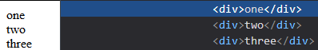
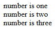
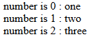
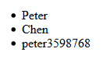
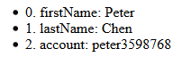
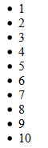
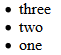
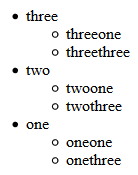

# 列表渲染

在 vue 中，要在頁面上綁定資料時會使用不同的 Directives 或是模板語法做操作，但這些綁定方式都是針對單純的資料格式，當資料是一個複雜的結構像是陣列及物件時，就必須要使用本篇介紹的 `v-for` 來將複雜的資料結構巡覽，抽出每個單一的元素，再用這些抽出的資料做模板的設定。

## 使用 `v-for` 綁定陣列資料

`v-for` 可以設定在元素上，使這個元素依照其設定的陣列重復渲染相同的模板，來看下面這個例子:

```js
var vm = new Vue({
  data: {
    items: ['one', 'two', 'three']
  }
});
```

建立一個陣列資料 `items` ，`items` 將被當成 `v-for` 做列表渲染的資料。

```html
<div v-for="item in items">{{item}}</div>
```

HTML 上的 `v-for` 值是以特殊的語法 `item in items` 設定，中間以 `in` 分開分為:

* `item` : 每個元素的資料。
* `items` : 原本的陣列資料。

這樣一來，我們可以用 `item` 在模板上綁定陣列中單一元素的資料，像是 `{{item}}` 就會依序綁定 `one` 、 `two` 及 `three` 到頁面上。

頁面上會如下圖顯示:



上面的例子可以知道下面幾點:

* `v-for` 將 `items` 中的每個元素資料做巡覽並綁定到 `item` 上。
* 設定 `v-for` 的 DOM 元素(這裡是 `<div>` )，會依照陣列的元素數量配置多次。
* 在 `v-for` 設定的 DOM 元素中可以使用巡覽元素的資料(這裡是 `item` )。

### v-for 的區塊中可以使用上層的所有屬性

雖然在 `v-for` 所設定的元素中我們可以使用巡覽的陣列元素，但我們還是可以使用上層的所有屬性，看看下面的例子:

```js
var vm = new Vue({
  data: {
    itemHeader: 'number',
    items: ['one', 'two', 'three']
  }
});
```

我們新增一個 `itemHeader` 的資料，並且在 `v-for` 元素下使用:

```html
<div v-for="item in items">{{itemHeader}} is {{item}}</div>
```

結果如下:



頁面可以正常渲染。

### 陣列的元素可以是物件

陣列中的每個元素可以是複雜的物件結構，如下面的例子:

```js
var vm = new Vue({
  data: {
    itemHeader: 'number',
    items: ['one', 'two', 'three'],
    objItems: [
      {name: 'one', number: 1},
      {name: 'two', number: 2},
      {name: 'three', number: 3}
    ]
  }
});
```

建立一個 `objItems` ，每個元素都是一個有 `name` 及 `number` 的物件。

```html
<div id="app">
  <div v-for="item in items">{{itemHeader}} is {{item}}</div>
  <div v-for="item in objItems">Eng: {{item.name}}, Number: {{item.number}}</div>
</div>
```

用 `item.name` 及 `item.number` 取得資料值。

> `v-for` 建立的 `item` 可以想成是一個只存在於 `v-for` 區塊中的資料，所以如上例兩個不同的 `v-for` 用相同的 `item` 命名陣列元素資料是可行的。

### 使用 `index` 參數

`v-for` 除了基本的 `item in items` 語法，還提供了 `(item, index) in items` 給使用者，使用 `index` 資料就可以知道目前的元素是第幾個巡覽的資料。

使用之前的例子改寫，加上 `index` 參數:

```html
<div v-for="(item, index) in items">{{itemHeader}} is {{index}} : {{item}}</div>
```

頁面結果如下:



> `index` 是以 `0` 為起始值。

### 使用 `of` 代替 `in`

前面介紹的語法中都是以 `in` 來設定 `v-for` ，但 vue 也提供了 JavaScript 巡覽語法中的 `of` 當作關鍵字，所以上面的例子都可以將 `in` 改為 `of` :

```html
<div v-for="item of items">{{itemHeader}} is {{item}}</div>
<div v-for="item of objItems">Eng: {{item.name}}, Number: {{item.number}}</div>
<div v-for="(item, index) of items">{{itemHeader}} is {{index}} : {{item}}</div>
```

## 使用 `v-for` 綁定物件資料

`v-for` 也可以使用物件做巡覽，語法跟陣列相同，但其巡覽出來的資料是屬性值，如下例:

```js
var vm = new Vue({
    obj: {
      firstName: 'Peter',
      lastName: 'Chen',
      account: 'peter3598768'
    }
  }
});
```

`obj` 資料上有不同的屬性 `firstName` 、 `lastName` 及 `account` ，現在我們使用 `v-for` 來巡覽:

```html
<div id="app">
  <ul>
    <li v-for="value in obj">{{value}}</li>
  </ul>
</div>
```

`value` 會是每個屬性的 `value` : `Peter` 、 `Chen` 以及 `peter3598768` ，結果如下圖:



### 物件巡覽鍵值及 `index`

物件跟陣列一樣有提供多的參數供開發者使用:

* `(value, key) in obj` : 第二個參數為屬性的建值。
* `(value, key, index) in obj` : 第三個參數為巡覽的 `index` 。

我們將上面的例子改為三個參數的宣告方式:

```html
<ul>
  <li v-for="(value, key, index) in obj">{{index}}. {{key}}: {{value}}</li>
</ul>
```

結果如下:



> 物件的巡覽是使用 `Object.keys()` ， 它不保證順序會跟原本的相同，例如 `Object.keys({2: 'two', 0: 'zero', 1: 'one' })` 出來的結果會是 `[ "0", "1", "2" ]` ，因此 `v-for` 不能保證其順序。

## 使用範圍做列表渲染

`v-for` 除了陣列及物件的渲染方式，它還有一個特殊的渲染方式像是 `n in 10` :

* `10` : 範圍定義。
* `n` : 目前所在的數字。

在這裡用一個數字替代陣列或物件，代表列表的長度， `n` 就是目前所在的數字。

範例如下所示:

```html
<ul>
  <li v-for="n in 10">{{n}}</li>
</ul>
```

渲染的結果如下:



## 使用 `key` 屬性決定復用行為

在之前介紹 `v-if` 的時候，有說到可以使用 `key` 來決定兩個元素是否復用，在 `v-for` 中也是一樣。

當 `v-for` 的陣列或是物件改變時， vue 會去比對修改前及修改後的元素是否可以復用，以復用元素的方式減少建立及銷毀元素增加效能。

這時加上 `key` 屬性可以讓 vue 有個依據來辨識每個節點，因此在使用 `v-for` 的時候最好為每個節點加上 `key` 屬性，並且每個節點的 `key` 值最好是唯一的，像是下面這樣:

```html
<div v-for="item in objItems" :key="item.number">Eng: {{item.name}}, Number: {{item.number}}</div>
```

使用 `v-bind` 綁定 `key` 屬性值為每個元素的 `number` 值。

> 這裡帶出了另一個容易混淆的點，可以注意到 `v-for` 及 `:key` 設定在相同的元素上，但是 `:key` 的值卻可以使用 `v-for` 定義的 `item` ，這樣的行為是因為 `v-for` 的優先權較 `v-bind` 高所產生的，在下一節會使用 `v-if` 講解這個情形。

## `v-for` 及 `v-if` 使用於同個 DOM 元素

因為 `v-if` 的優先權較 `v-for` 低，因此設置在同個節點上時，會先執行 `v-for` 的列表渲染機制，再於每個元素上做 `v-if` 的行為，如下例所示:

```html
<div v-for="(item, index) in items" v-if="index > 0">{{itemHeader}} is {{index}} : {{item}}</div>
```

在 `v-if` 上可以使用 `index` 這個巡覽產生的變數，因此可以想成渲染時先經過 `v-for` 產生如下的結構:

```html
<div v-if="index > 0">{{itemHeader}} is {{index}} : {{item}}</div>
<div v-if="index > 0">{{itemHeader}} is {{index}} : {{item}}</div>
<div v-if="index > 0">{{itemHeader}} is {{index}} : {{item}}</div>
```

最後在渲染成最後的結構:

```html
<div>number is 1 : two</div>
<div>number is 2 : three</div>
```

> 當然 vue 不會真的將所有的元素渲染至頁面上在做銷毀的動作，它會在要渲染前就把最終的結構給取得。

## 在 `<template>` 中使用 `v-for`

跟 `v-if` 相同， `v-for` 也可以使用 `<template>` 一次渲染多個元素:

```html
<ul>
  <template v-for="(value, key, index) in obj">
    <li>{{index}}. Key: {{key}}</li>
    <li>{{index}}. Value: {{value}}</li>
  </template>
</ul>
```

將 `key` 及 `value` 以不同的 `<li>` 渲染，因為 `<li>` 的上層一定要是 `<ul>` ，所以本例一定要使用到 `<template>` 。

## 排序或是過濾列表

有時，資料結果會經過排序或過濾來顯示在頁面上，這時可以使用計算屬性來達成這個目的:

```js
var vm = new Vue({
  data: {
    objItems: [
      {name: 'one', number: 1},
      {name: 'two', number: 2},
      {name: 'three', number: 3}
    ]
  },
  computed: {
    sortedObjItems() {
      return this.objItems.reverse();
    }
  }
});
```

```html
<ul>
  <li v-for="item in sortedObjItems">{{item.name}}</li>
</ul>
```

結果會變為反序:



使用計算屬性可以解決大部分的需求，但如果資料是需要巢狀使用 `v-for` 的話，計算屬性就派不上用場了，因為計算屬性只能設定實體中的資料屬性，這時我們可以使用方法來達成需求。

範例如下:

```js
var vm = new Vue({
  data: {
    objItems: [
      {name: 'one', number: 1, points: [
        {name: 'oneone', number: 11},
        {name: 'onetwo', number: 12},
        {name: 'onethree', number: 13}
      ]},
      {name: 'two', number: 2, points: [
        {name: 'twoone', number: 21},
        {name: 'twotwo', number: 22},
        {name: 'twothree', number: 23}
      ]},
      {name: 'three', number: 3, points: [
        {name: 'threeone', number: 31},
        {name: 'threetwo', number: 32},
        {name: 'threethree', number: 33}
      ]}
    ]
  },
  methods: {
    oddPoints(points) {
      return points.filter(point => point.number % 2 !== 0);
    }
  }
});
```

這裡做了兩個更改:

* 在每個 `item` 中加上 `points` 屬性，裡面定義物件陣列。
* 定義 `point` 需要的過濾方法: `oddPoints` 。

現在使用兩層的 `v-for` 將 `point` 資料渲染在頁面上:

```html
<ul>
  <li v-for="item in sortedObjItems">
    {{item.name}}
    <ul>
      <li v-for="point in oddPoints(item.points)">{{point.name}}</li>
    </ul>
  </li>
</ul>
```

這裡因為 `points` 這個物件會是巡覽後才能得到的物件，並不是直接定義在實體中的屬性，因此不能使用不能傳入參數的計算屬性，要改為使用方法。

頁面的結果如下:



## DEMO

* [CodePen](https://codepen.io/peterhpchen/pen/oaVEYx)

## 小結

這章首先介紹了 `v-for` 的三種定義方式: **陣列**、**物件**以及**範圍**，之後講述 `v-for` 的特性，像是定義 `key` 屬性來提供 vue 復用元素的依據、優先權較 `v-if` 高以及可以使用 `<template>` 定義多個元素，最後提供來源及顯示結果不同時的解決方式。

## 參考資料

* [Vue.js Guide: List Rendering](https://vuejs.org/v2/guide/list.html)