# 表單綁定

目前為止我們使用了 `v-bind` 及 `{{}}` 綁定資料至模板上，但這兩個方式都是從 view model 到 view 的單向綁定，而模板上如果有 `input` 或是 `textarea` 等的輸入欄位時，會需要將在 view 上更新的資料傳回至 view model 上，這時就需要使用 `v-model` 這個雙向綁定的屬性。

## 字串

### Text

字串的綁定方式如下:

```html
<button @click="msg=''">Clear</button>
<input placeholder="Edit" v-model="msg"> {{msg}}
```

在 `input` 標籤中加入 `v-model` 屬性，上面綁定目標資料，這樣就可以從頁面上的輸入框更新資料，也可以藉由更新資料來改變輸入框內的內容(上例中可以用 `Clear` 按紐演繹)。

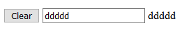

### Multiple Text

要綁定多行字串可以使用 `textarea` 標籤:

```html
<textarea placeholder="Edit" v-model="msgarea"></textarea>
<p style="white-space: pre-line">{{msgarea}}</p>/
```

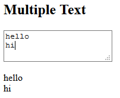

> 在 `textarea` 標籤內用 `{{}}` ，像是 `<textarea>{{message}}</textarea>` 是不能綁定資料的，請直接使用 `v-model` 綁定。

### 初始設定

`input` 或是 `textarea` 標籤中只要有綁定 `v-model` 都會忽略 `value` 屬性的設定，所以要設定初始值可以在 Vue 實體中的資料屬性設置。

例子如下:

```html
<input placeholder="Edit" v-model="msg" value="initial"> {{msg}}
```

以前設定一個輸入框的初始值都會使用 `value` 屬性，但是加上 `v-model` 後我們不用再使用 `value` 設定了，而是直接在 Vue 實體中的 `data` 屬性設定初始值，

可以將上例的 `v-model` 刪除，可以看到沒有 `v-model` 時，輸入框的值會依照 `value` 設定的 `initial` 去渲染，可是加上 `v-model` 後就會使用資料屬性設定初始值。

### 使用 IME 輸入

中文、日文或是韓文的輸入法會需要將多個字組合後才會變為一個完整的字，例如中文的**嗨**就需要鍵入**ㄏㄞˋ**後按下 `Enter` 鍵才會輸入， `v-model` 並不會在拼音時就更新資料，而是會在按下 `Enter` 後才更新，因此如果想要讓資料響應拼音，可以直接使用 `input` 事件實作。

如下例子:

```html
<div>
  <button @click="msg=''">Clear</button>
  <input placeholder="Edit" v-model="msg"> {{msg}}
</div>
<div>
  <button @click="msg2=''">Clear</button>
  <input placeholder="Use IME" :value="msg2" @input="msg2=$event.target.value"> {{msg2}}
</div>
```

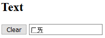

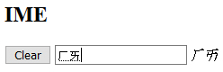

`msg` 是之前使用 `v-model` 綁定資料的例子，它不能及時響應 IME 的變化，但是使用 `input` 事件綁定的例子就可以在拼音時改變資料。

## 選項

### Checkbox

`checkbox` 綁定的會是布林值，判斷這個選項是否有勾選:

```html
<input type="checkbox" id="checkbox" v-model="checked">
<label for="checkbox">{{ checked }}</label>
```

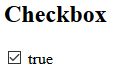

### Multiple Checkbox

多選的 `checkbox` 可以使用陣列綁定多個 `input` 的值，當有勾選時，綁定的資料陣列會加上這個 `input` 標籤的 `value` 屬性值。

如下例:

```html
<div>
  <div>What are you learning? {{multipleChecked}}</div>
  <input type="checkbox" id="vue" value="Vue" v-model="multipleChecked">
  <label for="vue">Vue</label>
  <br/>
  <input type="checkbox" id="react" value="React" v-model="multipleChecked">
  <label for="react">React</label>
  <br/>
  <input type="checkbox" id="angular" value="Angular" v-model="multipleChecked">
  <label for="angular">Angular</label>
  <br/>
</div>
```

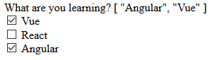

### Radio

`radio` 也是把多個選項綁定至一個資料，但因為 `radio` 只能單選，所以資料會是字串而非陣列:

```html
<div>
  <div>Are you learning Vue ? {{isLearningVue}}</div>
  <input type="radio" id="yes" value="Yes" v-model="isLearningVue">
  <label for="yes">Yes</label>
  <input type="radio" id="no" value="No" v-model="isLearningVue">
  <label for="no">No</label>
  <br/>
</div>
```

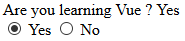

### Select

下拉式選單的綁定方式如下:

```html
<div>
  <div>What are you select? {{selected}}</div>
  <select v-model="selected">
    <option disabled value="">Please select one</option>
    <option value="A">A</option>
    <option value="B">B</option>
    <option value="C">C</option>
  </select>
  <br/>
</div>
```

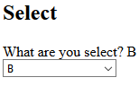

> 如果初始值沒有符合任何的選項時， `select` 標籤會處於未選擇的狀態，也就是選項框中沒有任何值，在 IOS 下會有問題，因此最好的方法就是增加一個初始的選項，像是 `<option disabled value="">Please select one</option>` 來解決此問題。

### Multiple Select

多選跟多個 `checkbox` 一樣會綁定至陣列上:

```html
<div>
  <div>What are you select? {{multipleSelected}}</div>
  <select v-model="multipleSelected" multiple>
    <option value="A">A</option>
    <option value="B">B</option>
    <option value="C">C</option>
  </select>
  <br/>
</div>
```

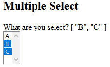

> `selected` 、 `checked` 屬性在有設置 `v-model` 時都會失效，請直接使用 Vue 實體中的資料屬性設置初始值。

### 使用 `v-for` 設置選項

我們可以使用之前學過的 `v-for` 來設置繁多選項元素:

```js
var vm = new Vue({
  el: '#app',
  data: {
    options: [
      {value: 'A', text: 'A'},
      {value: 'B', text: 'B'},
      {value: 'C', text: 'C'}
    ],
    forselect: 'A'
  }
});
```

```html
<div id="app">
  <h2>options render by v-for</h2>
  <div>
    <div>What are you select? {{forselect}}</div>
    <select v-model="forselect">
      <option v-for="option in options" :value="option.value">{{option.text}}</option>
    </select>
    <br/>
  </div>
</div>
```

## 選項數值綁定

上面的選項綁定都是使用靜態的數值綁定，如果需求是要動態綁定數值時， `checkbox` 可以用 `true-value` 及 `false-value` 來綁定，而 `radio` 及 `select` 可以用 `v-bind` 綁定 `value` 。

### Checkbox

`checkbox` 使用 `true-value` 及 `false-value` 分別綁定勾選及未勾選時的資料，範例如下:

```js
var vm2 = new Vue({
  el: '#app2',
  data: {
    checked: 'Hello',
    yes: 'Hello',
    no: 'Bye',
  }
});
```

設定 `yes` 及 `no` 資料屬性，在勾選時為 `yes` 的 `Hello` 字串，而未勾選時為 `no` 的 `Bye` 字串。

```html
<h2>Checkbox Value Binding</h2>
<div>
  <input type="checkbox" id="checkboxvaluebinding" v-model="checked" :true-value="yes" :false-value="no">
  <label for="checkboxvaluebinding">{{ checked }}</label>
</div>
```

> 瀏覽器不會送出未勾選的 `checkbox` 資料，所以如果一定要送出每個選擇的資料的話，可以改用 `radio` 。

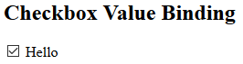

### Radio

直接使用 `v-bind` 綁定 `value` 就可以使用資料屬性的字串設定 `radio` 的值:

```html
<h2>Radio Value Binding</h2>
<div>
  <div>{{helloOrBye}}</div>
  <input type="radio" id="radiovalueyes" :value="yes" v-model="helloOrBye">
  <label for="radiovalueyes">Yes</label>
  <input type="radio" id="radiovalueno" :value="no" v-model="helloOrBye">
  <label for="radiovalueno">No</label>
</div>
```

我們使用了跟前例相同的 `yes` 、 `no` 資料，所以選擇第一個時 `model` 值會是 `hello` ，而選第二個時會是 `bye` 。

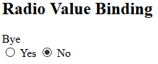

### Select

`Select` 的選項跟 `Radio` 一樣直接將 Vue 實體中的資料屬性綁定 `value` 即可。

```html
<h2>Select Value Binding</h2>
<div>
  <div>What are you select? {{selected}}</div>
  <select v-model="selected">
    <option disabled value="">Please select one</option>
    <option :value="yes">{{yes}}</option>
    <option :value="no">{{no}}</option>
  </select>
  <br/>
</div>
```

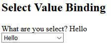

## 修飾符

### `.lazy`

原本的 `v-model` 會在 `input` 事件觸發時更新資料，加上 `.lazy` 修飾符後，更新的時間點會被延到 `change` 事件時，因此如果加上 `.lazy` ，要在離開輸入框時才會更新資料:

```html
<h2>.lazy</h2>
{{lazy}}
<input placeholder="lazy" v-model.lazy="lazy">
<input placeholder="normal" v-model.normal="lazy">
```

* `lazy` : 輸入完離開輸入框後更新資料。
* `normal` : 按下按鍵後立即更新。

### `.number`

如果想讓此輸入框的類型維持在數字，必須要使用 `.number` 修飾符，因為 HTML 的輸入框就算把 `type` 調成 `number` ，鍵入值的類型會是會是字串，如下例所示:

```html
<h2>.number</h2>
{{typeof number}}
<input v-model.number="number" type="number">
<input v-model="number" type="number">
```

可以先撥動第一個輸入框的數值， `{{typeof number}}` 會是 `number` ，之後撥動第二個輸入框，可以看到 `{{typeof number}}` 變為 `string` 。

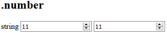

### `.trim`

`.trim` 修飾符會將使用者輸入的字串做 `trim` 的動作:

```html
<h2>.trim</h2>
<input v-model.trim="trim">
```

可以輸入 `'  hello  '` ，然後在 `console` 印出 `trim` 的資料，可以看到輸出的資料為 `'hello'` 。

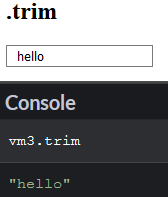

## Demo

* [CodePen](https://codepen.io/peterhpchen/pen/PxozpN)

## 結語

本文介紹了 `text` 、 `checkbox` 、 `radio` 及 `select` 的雙向綁定方式，並且介紹 `checkbox` 、 `radio` 及 `select` 動態綁定選項數值的方式，最後講解 `.lazy` 、 `.number` 及 `.trim` 修飾符的功能及用法。

## 參考資料

* [Vue.js Guide: Form Input Binding](https://vuejs.org/v2/guide/forms.html)