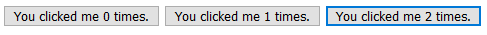
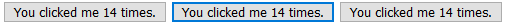
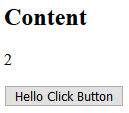
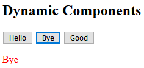
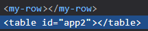

# 組件基礎

Vue 的應用程式由多個實體所串連，形成一棵組件樹，它只會有一個根節點，就是 `new Vue` 的實體，底下都是稱為 Component 的組件，組件的開發方式跟 `new Vue` 相同，都是設定**選項物件**，但物件內的屬性跟 `new Vue` 會有些差異，現在讓我們看看如何建立及使用組件吧。

## 建立組件

組件的建立是使用 `Vue.component` 註冊組件，然後使用跟 `new Vue` 相同的**選項物件**設定組件的定義，但因為只有 `new Vue` 可以使用 `el` 屬性定義掛載目標(因為它是根節點)，所以組件需要使用 `template` 或是 `render` 函數設定目標模板，如下例所示:

```js
Vue.component('button-counter', {
  data: function() {
    return {
      count: 0
    }
  },
  template: '<button v-on:click="count++">You clicked me {{ count }} times.</button>'
})
```

註冊一個 `button-counter` 的組件，這個組件的模板是定義在 `template` 屬性上的按紐，按鈕有設定一個 `click` 事件，按下去會使組件裡設定的資料屬性 `count` 加一。

```html
<div id="app">
  <button-counter></button-counter>
</div>
```

```js
var vm = new Vue({
  el: '#app'
});
```

在 `new vue` 的掛載 DOM 元素中只要使用註冊組件時設定的名稱 `button-counter` 當作 DOM 元素設置在 HTML 上就可以把組件掛到目標位置上。

## 組件的重複使用

在同個 Vue 實體中，我們可以同時使用多個相同的組件，如下所示:

```html
<div id="app">
  <button-counter></button-counter>
  <button-counter></button-counter>
  <button-counter></button-counter>
</div>
```

這樣我們就可以有三個計算按紐，它們都有自己的實體屬性，像是 `count` ，在每一個組件內都是各自獨立的，所以你按下按鈕所加的數字都只有這個組件本身。



## 組件與 `new Vue` 的差異

組件跟 `new Vue` 的選項設定有兩個不一樣的地方:

* `el` : 只有在 `new Vue` 時才能設定 `el` 屬性。
* `data` : 組件一定要用函數的方式回傳物件。

### `el` 屬性

前面章節定義模板的方式都是在 HTML 配置模板後使用 `el` 屬性掛載模板目標的 DOM 元素，可是 `component` 沒有這個屬性，所以必須要使用前面介紹的 `template` 屬性來設定。

* 下面的例子使用 `new Vue` 實作 `button-counter` :

```html
<button id="button-counter" v-on:click="count++">
  You clicked me {{ count }} times.
</button>
```

```js
var buttonCounter = new Vue({
  el: '#button-counter',
  data: {
    count: 0
  }
});
```

* 下面的例子使用組件實作 `button-counter` :

```html
<div id="app">
  <button-counter></button-counter>
</div>
```

```js
Vue.component('button-counter', {
  data: function() {
    return {
      count: 0
    }
  },
  template: '<button v-on:click="count++">You clicked me {{ count }} times.</button>'
})

var vm = new Vue({
  el: '#app',
  data: {
    count: 0
  }
});
```

### `data` 屬性

由於組件可能會有復用的情形，因此每個資料屬性必須要擁有獨立的實體，所以在組件中的 `data` 屬性需要使用函數來回傳一個全新的物件。

下面的例子模擬所有的 `component` 共用同個物件時會發生的問題:

```js
var buttonCounter2Data = { count: 0 }
Vue.component('button-counter', {
  data: function() {
    return buttonCounter2Data;
  },
  template: '<button v-on:click="count++">You clicked me {{ count }} times.</button>'
})
```

組件的資料屬性都是回傳一個 `buttonCounter2Data` 的物件，代表這個物件會在 `button-counter` 中被共用，現在我們跟之前的例子一樣，在同一個實體渲染三個 `button-counter` 組件:

```html
<div id="app">
  <button-counter></button-counter>
  <button-counter></button-counter>
  <button-counter></button-counter>
</div>
```



因為所有的組件都共用同個 `buttonCounter2Data` 物件中的 `count` ，因此修改了其中一個組件的 `count` 資料，其他兩個也會一起更新。

## 組件的結構限制

任何的 Vue 實體，包括 `new Vue` 及組件，因為 `render` 函數使用上的限制，它們的根元素只能有一個，因此如果想要在組件中有兩個以上的元素時，要使用一個包裝用元素包住多個元素才能使用。

以上面的計算按紐為例，現在我們想要在每個組件中加上 `count` 的顯示:

```js
Vue.component('button-counter', {
  data: function() {
    return {
      count: 0
    }
  },
  template: `
    <div>
      <p>{{count}}</p>
      <button v-on:click="count++">Click</button>
    </div>
  `
})
```

因為多了一個 `<p>` 標籤，使得組件 DOM 元素變成了兩個，所以要多使用一個 `<div>` 來包住這兩個元素，使得根 DOM 元素只有一個。

> 上面的例子使用了 [template literal](https://developer.mozilla.org/en-US/docs/Web/JavaScript/Reference/Template_literals) 讓字串的設定可以直接換行，但在 IE 會無法使用這個特性，如果有 IE 需求的話請使用一般的 [newline escapes](https://css-tricks.com/snippets/javascript/multiline-string-variables-in-javascript/) 或是 Babel 之類的轉譯器。

## 組件內容

如果想要設定組件內容的話，可以使用 `<slot>` 標籤來決定組件內容的配置:

```js
Vue.component('button-counter', {
  data: function() {
    return {
      count: 0
    }
  },
  template: `
    <div>
      <p>{{count}}</p>
      <button v-on:click="count++">
        <slot>
          Click
        </slot>
      </button>
    </div>
  `
});
```

我們將原本的按鈕內容中加上 `<slot>` 標籤，當我們要客製按鈕上的字串時，只要像下面這樣:

```html
<div id="app4">
  <button-counter>Hello Click Button</button-counter>
</div>
```

利用設定 <button-counter> 內容，我們可以改變 `slot` ，因此按鈕會變為 `Hello Click Button`:



> `<slot>` 標籤內的內容是預設值，所以當你的組件內容是空的時候(像是 `<button-counter></button-counter>` )會使用預設的 `Click` 字串渲染按紐。

## `is` 屬性

`is` 屬性可以改變設定此 DOM 元素欲使用的組件，有兩個情境會使用到這個屬性:

* 動態載入組件。
* HTML 元素配置限制。

### 動態載入組件

如果此組件會在程式執行時改變，那就不能直接設定在模板上，可以使用 `is` 取得組件， Vue.js 會依照這個組件去渲染 DOM 元素，如下例所示:

```html
<div id="app3">
  <button @click="dynamicComponent='hello'">Hello</button>
  <button @click="dynamicComponent='bye'">Bye</button>
  <button @click="dynamicComponent={template: `<p style='color: purple'>Good</p>`}">Good</button>
  <component :is="dynamicComponent"></component>
</div>
```

在 `component` 標籤上設定 `is` 屬性綁定 `dynamicComponent` ，而上面有三個按紐，分別使用:

* `hello` 組件。
* `bye` 組件。
* 使用**選項物件**設定。

第一個跟第二個按紐示使用**組件名稱**設定，而第三個是直接使用**選項物件**來設定。

因此在按下不同按紐時會依照不同的組件設定改變:



### HTML 元素配置限制

在像是 `<ul>` 、`<ol>` 、 `<table>` 及 `<select>` 標籤下會有限制使用的元素，例如 `<table>` 下層就一定要使用 `<tr>` ，可是當你使用組件設定這些下層元素時，會如下面這樣設定:

```html
<table id="app2">
  <my-row></my-row>
</table>
```

這時 <my-row> 會因為是錯誤的標籤而被抬升:



可以看到 `<my-row>` 被抬到 `<table>` 外面了，為了防止這樣的問題，我們可以用 `is` 屬性在 `<tr>` 標籤上設定想要使用的組件，這樣就不會被判定為錯誤的標籤了:

```html
<table id="app2">
  <tr is="my-row"></tr>
</table>
```

## Demo

* [CodePen](https://codepen.io/peterhpchen/pen/oQNmGE)

## 結語

今天介紹了**組件的定義及設定方式**，還有與 `new Vue` 的不同之處(`el` 及 `data` 屬性)，最後說了一些組件在設定上需要注意的點(**單一根節點**)及特別的使用方式( `<slot>` 標籤及 `is` 屬性)。

下一節會是組件基礎的第二部分，會介紹上層組件及下層組件如何透過 `props` 屬性及 `$emit` 方法溝通。

## 參考資料

* [Vue.js Guide: Components Basics](https://vuejs.org/v2/guide/components.html)
* [Vue.js API: is](https://vuejs.org/v2/api/#is)