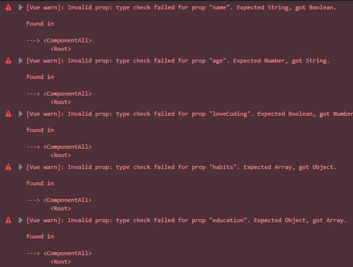
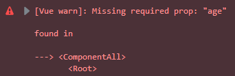
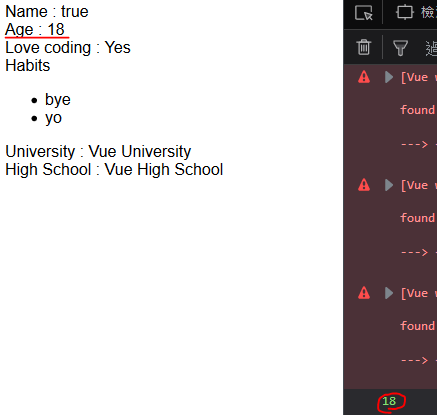
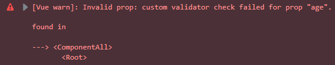

# 屬性驗證

`props` 最簡單的宣告方式就是使用陣列宣告，但 `props` 其實可以用物件宣告，而物件中可以定義此屬性的類型、驗證器等等，本文將介紹如何在屬性宣告中加入各式的定義。

> 由於 Vue 的屬性警告訊息在 **CodePen** 中不會顯示，所以練習本文的例子時請自己把程式碼跑起來做驗證。

## 定義屬性型別

先來複習使用陣列定義的寫法:

```js
props: ['name', 'age', 'loveCoding', 'habits', 'education']
```

陣列的每個元素都是一個屬性，可是這些屬性都沒有限制它們的型別，現在可以使用物件來定義每個屬性的型別:

```js
props: {
  name: String,
  age: Number,
  loveCoding: Boolean,
  habits: Array,
  education: Object
},
```

當使用了錯誤的類別後，在 Console 中會出現警告訊息:



訊息中會告訴你錯誤的**屬性名稱**、**期望類別**跟**實際類別**，最後還會跟你說在哪個組件中發生這個問題，在開發及除錯時十分方便。

### 複數型別

有時候一個屬性的合法型別會有多個，Vue.js 提供以陣列還定義複數個型別的設定方式:

```js
...
props: {
  ...
  age: [Number, String],
  ...
},
...
```

```js
data: {
  ...
  age: '十八', // 18,   // 都合法
  ...
}
```

上例將 `age` 的型別設為 `Number` 或 `String` 都是合法的，因此 **十八** 跟 **18** 都是合法值。

### 適用型別

屬性的型別檢查適用於下面這些類型:

* `String`
* `Number`
* `Boolean`
* `Array`
* `Object`
* `Date`
* `Function`
* `Symbol`

### 自定型別

Vue.js 提供使用者可以用客製建構子檢查型別:

```js
function Education(university, highSchool) {
    this.university = university;
    this.highSchool = highSchool;
}
```

在 `props` 上直接設定 `Education` 即可:

```js
props: {
  education: Education
},
```

只要是以 `new Education` 建出來的物件都是合法的，如下所示:

```js
data: {
  education: new Education('Vue University', 'Vue High School')
}
```

客製的檢查方式會以 `instanceof` 來確認兩個型別是否相等。

## 使用物件設定每個屬性

前面已經提到了三種設定屬性的方式:

* 陣列

```js
props: ['name', 'age', 'loveCoding', 'habits', 'education']
```

* 物件( `Value` 是型別)

```js
props: {
  name: String
},
```

* 物件( `Value` 是陣列)

```js
props: {
  age: [Number, String]
}
```

接著要介紹的方式是在一般專案最常用，也是功能最多的設定方式是 `props` 的值是物件，而各屬性的值也是物件的方式:

```js
props: {
  age: {
    type: Number,
    required: true,
    default: 0,
    validator: function (value) {
      return value >= 0
    }
  }
}
```

其中的 `type` 就是上面介紹的**型別定義**，下面會依序介紹各個設定值。

## 是否必輸

當 `required` 設為 `true` 的時候，父組件如果沒有傳入屬性值就會跳錯誤訊息。

如下例的 age :

```js
props: {
  age: {
    required: true,
  },
},
```

如果父組件設定的屬性沒有 `age` :

```html
<component-all :name="name"
               :love-coding="loveCoding"
               :habits="habits"
               :education="education"></component-all>
```

會跳出下面的錯誤:



## 預設值

屬性沒有傳入值時使用預設值。

同上例， `age` 沒有傳入值，這時如果屬性有設預設值的話:

```js
props: {
  age: {
    default: 18,
  },
},
created: function() {
    console.log(this.age);
}
```

這個值會直接當做這個屬性的值。



右下角是 `created` 鉤子函數中的 `console.log` 輸出。

### 使用函數設定

除了直接設值外， `default` 還可以使用函數設置:

```js
props: {
  age: {
    default: function() {
        return 18;
    },
  },
},
```

## 驗證器

驗證器可以提供傳入值的驗證，如果是正確的傳回 `true` ，否則傳回 `false` :

```js
props: {
  age: {
    validator: function (value) {
        return value >= 0;
    }
  },
},
```

`validator` 的傳入參數是這個屬性的值，上例是當 `age < 0` 的情況下會出錯:

```html
<component-all :name="name"
               :age="-1"
               :love-coding="loveCoding"
               :habits="habits"
               :education="education"></component-all>
```

將 `age` 設為 `-1` 會導致驗證未過， `Console` 會出下面的錯誤:



## 預設值或是驗證器中不能使用實體中的其他資料屬性

`Props` 屬性的驗證是在 `created` 之前，這意味著實體中的屬性還未創建，因此在 `default` 是 `validator` 的函數中不能使用 `data` 或是 `computed` 等的資料屬性。

```js
props: {
  age: {
    default: function() {
      console.log(this.defaultAge); // undefined
        return 18;
    }, // 18,
    validator: function (value) {
        console.log(this.maxAge); // undefined
        return value >= 0;
    }
  },
},
data: function() {
    return {
        maxAge: 120
    };
},
computed: {
    defaultAge: function() {
        return this.maxAge / 5;
    }
},
```

## DEMO

* [GitHub](https://github.com/peterhpchen/VuejsQuest/blob/master/demo/24_PropsValidation/index.html)
* [CodePen](https://codepen.io/peterhpchen/pen/ZmbbEQ)

## 結語

本文介紹了屬性的定義方式，以及它的全部屬性( `type` 、 `required` 、 `default` 、 `validator` )介紹。

## 參考資料

* [Vue.js Guide: Prop Validation](https://vuejs.org/v2/guide/components-props.html#Prop-Validation)
* [Vue.js API: props](https://vuejs.org/v2/api/#props)