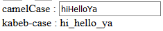

# 屬性注意事項

前兩章說明如何設定屬性及其進階的定義方式，本文要來聊聊關於屬性需要注意的事項。

## 屬性的資料流是單向的

在之前有提到 `props` 屬性是父組件跟子組件溝通的方式，而 `$emit` 方法是子組件產生變化時通知父組件的方式，所以 `props` 屬性本身是單向的，也就是由父組件傳至子組件，而子組件會隨著父組件所傳的屬性值更新狀態，但子組件不能藉由 `props` 屬性傳資料回父組件。

由於 `props` 本身是單向的，但在子組件中還是會有想要改變 `props` 的情況:

* 想要當作**區域變數**使用 Props : 這時我們可以將傳入的 Props 當作 `data` 的初始值，然後直接將 `data` 拿來用。

例如有一個 `counter` 組件，它需要父組件傳入初始值:

```js
Vue.component('counter', {
  props: ["initialCount"],
  data: function() {
    return {
      count: this.initialCount // 使用父組件傳入的屬性當作 count 資料的初始值
    }
  },
  template: `
    <div>
      <button @click="count++">+</button>
      <span>{{count}}</span>
      <button @click="count--">-</button>
    </div>
  `
});

var vm = new Vue({
  el: '#app'
});
```

在 HTML 中設定 `initial-count` :

```html
<div id="app">
  <counter initial-count="5"></counter>
</div>
```

這樣就可以把傳入的 `initialCount` 當作 `count` 的初始值了。

* 想要將傳入的屬性**格式化** : 可以用計算屬性將 Props 屬性改為組件中期望的格式。

例如有一個 kebab-case 轉譯器，可以把 camel case 轉為 kebab-case :

```js
Vue.component('kebab-case-converter', {
  props: ['camelCase'],
  computed: {
    kababCase() {
      return this.camelCase.replace(/([A-Z])/g, '_$1').toLowerCase();
    }
  },
  template: '<div>kabeb-case : {{kababCase}}</div>'
})
```

```html
camelCase : <input v-model="camelCase">
<kebab-case-converter :camel-case="camelCase"></kebab-case-converter>
```

這樣的設定可以把父組件傳入的值都轉為 kabeb-case :



遵守單向資料流原則會使組件的開發、除錯及測試變得更為單純，這是每個開發者都應該，也值得遵守的限制。

> 在 JavaScript 中，物件或是陣列都是傳址的方式傳入，所以如果在子組件改變了物件或陣列的屬性，它會影響到父組件的狀態，要特別小心。

## 不是 Props 的 DOM 屬性

如果在組件上設定屬性並沒有在組件中的 `props` 被定義，這個屬性會直接套用在組件的根元素上。

拿上例的 `kebab-case-converter` 組件做測試，在組件上加入 `data-test="test data"` 屬性設定:

```html
<kebab-case-converter data-test="test data" :camel-case="camelCase"></kebab-case-converter>
```

它會被渲染為:

```html
<div data-test="test data">kabeb-case : </div>
```

會直接設定到根元素 `div` 上。

## 合併父組件及子組件屬性

`class` 及 `style` 在合併父組件及子組件時會將父子組件所有的屬性合併。

如下面的例子所示:

```js
Vue.component('kebab-case-converter', {
  ...
  template: '<div class="thick">kabeb-case : {{kababCase}}</div>'
})
```

在子組件中加上 `class="thick"` 。

```html
<kebab-case-converter class="italic" data-test="test data" :camel-case="camelCase"></kebab-case-converter>
```

在父組件的屬性中加入 `class="italic"` 。

如此一來父組件的 `class` 屬性會跟子組件的 `class` 做合併，因此會輸出:

```html
<div class="thick italic" data-test="test data">kabeb-case : hello</div>
```

可以看到輸出變成 `class="thick italic"` 了。

## 由父組件替代子組件的屬性

除了 `class` 及 `style` 之外的其他屬性都會是由父組件蓋掉子組件屬性值。

將子組件修改為:

```html
<div class="thick" data-test="replaceMe">kabeb-case : {{kababCase}}</div>
```

父組件維持原本的樣子:

```html
<kebab-case-converter class="italic" data-test="test data" :camel-case="camelCase"></kebab-case-converter>
```

最後的合併會是下面這樣:

```html
<div data-test="test data" class="thick italic">kabeb-case : </div>
```

可以看到 `data-test` 不像是 `class` 那樣會合併結果，而是把子組件的值給蓋掉。

## 避免替代屬性

父組件的屬性蓋掉子組件的值有時會產生非預期的結果，為了避免這樣的問題， Vue.js 提供了 `inheritAttrs` 這個參數，它可以將組件設為不要帶入父組件的屬性值(只有那些沒有設定於子組件 `porps` 中的屬性值不會被帶入)。

`inheritAttrs` 常常搭配 `$attrs` 這個物件設定， `$attrs` 是父組件的屬性集合(沒有包含 `props` 中的屬性值)，有時我們不想將屬性值設於根元素中，可以使用 `inheritAttrs` 取消綁定屬性到根元素的行為，並且使用 `$attrs` 將屬性值綁定要我們期望的元素上。

> `class` 跟 `style` 不會受 `inheritAttrs` 效果影響，也不會包在 `$attrs` 物件上。

舉例，我們在 `counter` 組件上設定 `inheritAttrs: false` ，並且把 `$attrs` 綁定到 `<span>` 上:

```js
Vue.component('counter', {
  inheritAttrs: false,
  props: ["initialCount"],
  data: function() {
    return {
      count: this.initialCount
    }
  },
  template: `
    <div>
      <button @click="count++">+</button>
      <span v-bind="$attrs">{{count}}</span>
      <button @click="count--">-</button>
    </div>
  `
});
```

接著再父組件設定:

```html
<counter initial-count="5" class="thick" data-test="HelloTest"></counter>
```

我們得到的結果如下;

```html
<div class="thick">
    <button>+</button>
    <span data-test="HelloTest">5</span>
    <button>-</button>
</div>
```

* `class` : 因 `inheritAttrs` 及 `$attrs` 對 `class` 無效，所以還是在跟元素上。
* `data-test` : 因 `inheritAttrs` 的影響，所以不會出現在根元素上，但因 `$attrs` 綁定，所以會在 `span` 上。

## DEMO

* [CodePen](https://codepen.io/peterhpchen/pen/OaNWgw)

## 結語

本文補完了 `props` 屬性的一些注意事項，從單向資料流到非 `props` 屬性的合併及替代行為，最後介紹 `inheritAttrs` 及 `$attrs` 的搭配及使用方式。

## 參考資料

* [Vue.js Guide: Props](https://vuejs.org/v2/guide/components-props.html)
* [Vue.js API: inheritAttrs](https://vuejs.org/v2/api/#inheritAttrs)
* [Vue.js API: vm-attrs](https://vuejs.org/v2/api/#vm-attrs)