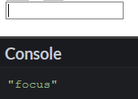

# 客製事件

前面用三章的篇幅介紹 Props ，接著本文要來介紹組件的另一個重要的部分: 事件，在 Vue.js 中使用 `v-on` 可以設定某事件觸發後要做的事情，而組件上的事件設定又更為彈性，可以使用開發者自訂的事件做更細部的操作，而通過事件將子組件資料傳回父組件更是開發組件中不可或缺的，現在讓我們來學習如何使用事件吧。

## 事件命名

客製的事件**不會轉換名字**，他會直接用原本的字串對應，因此如下面的子組件模板:

```html
<button @click="$emit('plusCount', count++)">+</button>
```

子組件中觸發 `plusCount` 事件，並把 `count` 加一的結果往上拋，現在看父組件中的設定:

```html
<counter @plus-count="count=$event"></counter>
```

父組件在模板上設定的事件名稱是 `plus-count` 這樣的 kabab-case 字串，但因為事件的名稱對應不存在任何的轉換，因此 `plusCount` 不會對應到 `plus-count` ，所以子組件拋出的 `plusCount` 不會觸發 `plus-count` 事件。

假設你今天用 `@plusCount` 做設定，則模板在轉換時會因為 HTML 是不分大小寫的而把事件名稱改為 `pluscount` ，這樣也不會監聽到 `plusCount` 的觸發，因此最好的方式就是都使用 kabab-case 名稱。

如下例:

```html
<!-- 子組件模板 -->
<button @click="$emit('plus-count', count++)">+</button>

<!-- 父組件模板 -->
<counter @plus-count="count=$event"></counter>
```

上例才是正確的，所以在事件命名時:

* `$emit` 的事件名稱使用 kabab-case 。
* 父組件上綁定的事件名稱使用 kabab-case 。

> 組件跟 `props` 屬性因為有可能是變數或是屬性，因此有可能會同時設定在 HTML 跟 JavaScript 代碼，所以需要在 kabab-case 及 camelCase 間轉換，但事件不同，事件並不會是變數或是屬性，它只有可能設定在 HTML 模板上，因此 Vue.js 就不做轉換的動作了，開發時直接使用 kabab-case 的命名就好。

## 客製組件的 `v-model`

之前有提到 `v-model` 是 `v-bind:value` 及 `v-on:input` 的語法糖，它的作用是做**雙向綁定**，但有些像是 `radio` 及 `checkbox` 需要 `value` 去綁定各別選項的值，而真正勾選的值是由像是 `checked` 之類的屬性綁定，為了避免 `v-model` 產生衝突，可以將 `model` 改為 `v-bind:checked` 及 `v-on:change` 來讓 `v-model` 運作正常。

下面的例子將 `model` 改為使用 `v-bind:checked` 及 `v-on:change` :

```js
Vue.component('base-checkbox', {
  model: {
    prop: 'checked', // 預設為 value
    event: 'change' // 預設為 input
  },
  props: ['checked', 'label'], // 跟 value 一樣， v-model 的 prop : cheked 要設定在 props 中
  template: `
    <label>
      <input
        type="checkbox"
        :checked="checked"
        @change="$emit('change', $event.target.checked)"
      >
      {{label}}
    </label>
  `
});
```

在子組件的實體中設定 `model` 物件，這個物件有兩個屬性 `prop` 及 `event` :

* `prop` : `v-model` 目標屬性。
* `event` : `v-model` 監聽的事件。

設定好 `model` 的 `prop` 及 `event` 後，就可以依照原生的 `checkbox` 勾選值去改變 `model` 值。

## 綁定原生事件

要綁定原生事件可以用 `native` 修飾符，這樣 Vue.js 會知道這個事件是原生的事件而直接綁定到**組件的根元素**上，如下例的輸入組件:

```js
Vue.component('base-input', {
  template: `
    <input>
  `
});
```

這個組件很簡單，只有一個 `<input>` 標籤，接著看一下父組件:

```html
<base-input @focus.native="onFocus"></base-input>
```

```js
var vm = new Vue({
  el: '#app',
  methods: {
    onFocus(){
      console.log('focus');
    }
  }
});
```

如此一來 `focus` 在輸入框時， `Console` 就會輸出 `focus` :



但是如果是像下面這樣設定子組件:

```js
Vue.component('base-input-with-label', {
  props: ['value', 'label'],
  template: `
    <label>
      {{label}}
      <input>
    </label>
  `
});
```

因為根元素是 `<label>` 而非 `<input>` ，所以 `@focus.native` 會綁定到 `<label>` 導致 `focus` 事件不會被觸發，為了解決這個問題， Vue.js 提供了 `$listeners` ，這個物件包含所有的父組件事件(排除有 `native` 修飾符的事件)，如此一來我們就可以使用 `$listeners` 綁定想要的元素。

將剛才的 `base-input-with-label` 的 `<input>` 綁定 `$listeners` :

```html
<label>
  {{label}}
  <input
    v-on="$listeners"
  >
</label>
```

將父組件中的 `focus` 事件拿掉 `native` 修飾符:

```html
<base-input-with-label @focus="onFocus"></base-input-with-label>
```

這樣就可以觸發 `<input>` 的 `focus` 事件。

### 合併父子組件的事件

使用 `v-on="$listeners"` 會使子組件的事件綁定出現問題，為了整合父子組件的事件，我們可以使用計算屬性將父子的事件合併後再統一綁定到元素上。

假設剛剛的 `input` 需要使用 `v-model` 綁定資料，我們本來會像下面這樣設定:

```html
<label>
  {{label}}
  <input
    :value="value"
    @input="$emit('input', $event.target.value)"
  >
</label>
```

但因為我們要多綁定 `$listener` ，所以使用一個計算屬性來合併:

```js
Vue.component('base-input-with-label', {
  props: ['value', 'label'],
  computed: {
    inputListeners: function () {
      var vm = this;
      return Object.assign({}, // 使用 Object.assign 合併物件
        this.$listeners, // 將 $listeners 的事件當作預設值
        {
          input: function (event) {
            vm.$emit('input', event.target.value)
          }
        } // 覆蓋 $listeners 中的 input 事件
      )
    }
  },
  template: `
    <label>
      {{label}}
      <input
        v-on="inputListeners"
        :value="value"
      >
    </label>
  `
});
```

直接綁定 `inputListeners` 就可以綁定父子組件合併後的事件。

> `$listeners` 跟 `$attrs` 搭配可以使客製組件上的設定跟原生的元素完全一樣，而不用去擔心組件中的模板配置。

## `.sync` 修飾符

有時屬性也跟 `model` 一樣會需要做雙向綁定，這時可以用客製事件達成，在 Vue.js 中官方建議使用 `update:[屬性名]` 的事件叫用父組件更新屬性，如下例所示:

```js
Vue.component('base-button', {
  props: ['title'],
  template: `
    <button @click="click">{{title}}</button>
  `,
  methods: {
    click() {
      const newTitle = this.title.split("").reverse().join("");
      this.$emit('update:title', newTitle);
    }
  }
});
```

父組件如下:

```html
<base-button :title="title" @update:title="title=$event"></base-button>
```

```js
var vm = new Vue({
  el: '#app',
  data: {
    title: 'I Love Vue.js'
  },
});
```

這樣我們就可在子組件中更新 `title` 的字串:


點擊按鈕會將名稱反序。

Vue.js 為了讓開發者撰寫的代碼較為單純而提供了 `.sync` 修飾符，它是一個屬性雙向綁定的語法糖，因此如下的屬性設定:

```html
<base-button :title.sync="title"></base-button>
```

其實就是剛剛的代碼:

```html
<base-button :title="title" @update:title="title=$event"></base-button>
```

> `.sync` 修飾符不能使用表達式設定，你只能像是 `v-model` 那樣使用屬性名稱做設置。

### `.sync` 綁定整個物件

之前介紹的 `.sync` 修飾符是綁定單一屬性，其實它也可以綁定物件:

```html
<base-button v-bind.sync="obj"></base-button>
```

```js
obj: {
  title: 'I am in obj'
}
```

`.sync` 會將物件中**所有的屬性**都當作子組件屬性傳入子組件，並且註冊每一個屬性的 `update` 事件。

## DEMO

* [CodePen](https://codepen.io/peterhpchen/pen/ZmOVpQ)

## 結語

本文介紹了客製事件，它的名稱只能使用 kabab-case ，也可以配合修改 `model` 的設定使 `v-model` 綁定不同的屬性及事件，再來使介紹原生事件的設定及合併父子組件的方法，最後講解 `.sync` 修飾符。

## 參考資料

* [Vue.js Guide: Custom Events](https://vuejs.org/v2/guide/components-custom-events.html)
* [Vue.js API: model](https://vuejs.org/v2/api/#model)
* [Vue.js API: vm.$listeners](https://vuejs.org/v2/api/#vm-listeners)