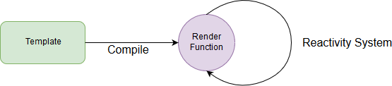

# 模板語法 Part 1 - Mustache 標籤

模板語法是 Vue.js 中常用的技術，除非你的應用程式不用渲染畫面或是直接使用 Render Function ，否則這是每個 Vue 開發者必學的技術之一。

模板語法是**邏輯**跟**頁面**之間的橋樑，使用模板語法編寫的 HTML 會像是活起來一樣的響應各種 Vue 實體中的變化，讓我們在 Vue 實體中的邏輯可以隨心所欲的顯現在頁面上。

本篇會帶大家先了解模板語法在 Vue.js 中的角色，之後會介紹 Mustache 標籤的使用。

## 模板

要了解模板首先要了解它跟 Render Function 的關係，它們都可以使 Vue 實體中的物件跟頁面產生連結，並且將物件的變化響應到頁面上，這其實是仰賴響應系統在背後作用，響應系統中的 watcher 會去追蹤實體中各個物件，一旦發生變化會通知 Render Function 做 re-render 的動作使畫面產生變化。

而模板跟 Render Function 可以用下面的圖來說明:



* 模板會經由 Compiler 編譯為 Render Function 。
* Render Function 會因響應系統的觸發而重新渲染頁面 。

這裡說明了一個重點: 要寫一個功能完整的 Vue.js 應用，可以完全不用寫模板語法。

Vue.js 的版本也同樣呼應這件[事情](https://vuejs.org/v2/guide/installation.html#Runtime-Compiler-vs-Runtime-only)，版本分為 Runtime + Compiler 和 Runtime-only ， Compiler 就是模板語法的編譯器，因此開發者如果直接撰寫 Render Function 來當作渲染方式，只要引入 Runtime-only 的版本就好了。

雖然模板不是必要的，但對於一般的開發者來說，可讀性高、簡單上手的模板語法還是第一選擇，如果要開發一個小功能要學會整套的 Render Function ，那可真的是吃不消阿。

> 使用 Render Function 方式開發的 Repository 也有像是 [Vuetify](https://github.com/vuetifyjs/vuetify) 這樣的大型專案。

## Mustache 標籤

上面講得比較遠了，現在回到模板**語法**上，這次要介紹的 Mustache 標籤，看起來是一個新的東西，但它在前面的篇章中都有出現，就是以兩個大括號(`{{}}`)綁定實體資料的語法。

下面是一個簡單的例子:

```js
var vm = new Vue({
  el: "#app",
  data: {
    a: 1
  },
  created() {
    setInterval(() => {
      this.a++;
    }, 1000);
  }
});
```

```html
<div id="app">
  {{a}}
</div>
```

Mustache 標籤會將實體上的 `a` 屬性值放到對應的 DOM 上，並且在每次 `a` 的值變化後會 re-render 頁面，因此上面的例子每過一秒，畫面上的數字就會加一。

### v-once

加上 `v-once` 這個 directive 可以讓 Mustache 標籤只渲染一次，使用的方式如下:

```html
<div id="app">
  <span>{{a}}</span>
  <span v-once>render once: {{a}}</span>
  ...
</div>
```

可以對照第一及第二個數字做比較，第二個數字永遠停在 `1` ，而第一個則是會一直往上加。

### JavaScript 陳述式

Mustache 標籤除了可以直接使用實體中的屬性外，我們也可以使用 JavaScript 的陳述式寫一些運算或判斷。

```html
<div id="app">
  ...
  <div>plus one: {{a + 1}}</div>
  <div>ternary expressions: {{a % 2 === 0 ? 'even' : 'odd'}}</div>  
  <div>length: {{a.toString().length}}</div>
  <div>Math.pow2: {{Math.pow(a, 2)}}</div>
</div>
```

Mustache 上的物件除了像是 `Math` 或 `Date` 這種在白名單中的全域物件外，不能使用像是 JQuery 之類的使用者自定義物件。

而除了全域物件外， Mustache 標籤只要看到變數都會去 Vue 實體中找，例如在上面定的 `a` 其實就是使用 `this.a` 的資料。

#### 陳述式不是代碼

陳述式會是一個值，可以想成是 `return [expression]` 這樣的代碼，由於 Mustache 裡只能撰寫陳述式，所以不能像下面這樣:

```html
<div id="app">
  ...
  <div>{{ var a = 0; }}</div>
  <div>{{ if (a > 100) a=1; }}</div>
</div>
```

如果對自己寫的陳述式有疑問，可以套用到 `return [expression]` 的公式上，看看在JavaScript 中是否合法來推斷，以上面的代碼來說，兩行都不是能合法 `return` 的代碼，因此它不能使用在 Mustache 標籤上。

> Mustache 的 JavaScript 陳述式雖然好用，但是由於不可復用及較差的可讀性，通常在開發時會用 `computed` 或是 `methods` 取代，後面的章節會在詳細講解。

## Demo

* [CodePen](https://codepen.io/peterhpchen/pen/LgrNLP)

## 小結

這章簡單講解模板語法在整個 Vue.js 中的位置，以及響應系統的基本概念，對於 Vue.js 如何渲染頁面有基礎的認識。

接下來搭配不同的例子講解 Mustache 標籤的使用方式，從最一般的字串綁定，到單次渲染的 `v-once` ，最後配合 JavaScript 陳述式寫出較複雜的渲染方式。

## 參考資料

* [Vue.js Guide: Template Syntax](https://vuejs.org/v2/guide/syntax.html)
* [Vue.js Guide: Reactivity in Depth](https://vuejs.org/v2/guide/reactivity.html)
* [Vue.js Guide: Installation](https://vuejs.org/v2/guide/installation.html)
