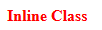
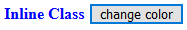

# Class 的綁定

`v-bind` 可以綁定各種不同的屬性，其中 Class 及 Style 的綁定較為特別，它們可以利用陣列或是物件綁定對應的 Class/Style 字串，現在讓我們來看看要如何設置 Class 吧。

## 使用字串設置 Class

在 Vue 中，可以使用實體中的資料來綁定 Class ，範例如下所示:

```html
<div id="app">
  <span :class="inlineClass">Inline Class</span>
</div>
```

```js
var vm = new Vue({
  el: '#app',
  data: {
    inlineClass: "red bold"
  }
});
```

```css
.red {
  color: red;
}

.bold {
  font-weight: bold;
}
```

畫面如下:



頁面確實有改變，因此代表 Class 有綁定到頁面上了。

### 修改 Class

大部分網頁都會需要改變頁面的樣式，讓使用者使用時像是一般應用程式那樣反應，舉凡強調選取項目、改變字體顏色等等，都會是 UI 設計的重點，而在網頁中通常會藉由更改 Class 來達成這些需求。

可是使用字串的綁定方式在修改 Class 上是極其麻煩的，以上面的例子進行擴充，我們加上 `change color` 的按鈕，按下後紅色的字體會變為藍色，如果原本是藍色則會變回紅色。

```html
<div id="app">
  <div>
    <span :class="inlineClass">Inline Class</span>
    <button @click="changeColor">change color</button>
  </div>
</div>
```

現在頁面上加顆 `change color` 的按鈕，會觸發 `changeColor` 方法:

```js
changeColor() {
  let classArr = this.inlineClass.split(' ');
  let redIndex = classArr.indexOf('red');
  if (redIndex !== -1) {
    classArr.splice(redIndex, 1, 'blue');
    this.inlineClass = classArr.join(' ');
    return;
  }
  let blueIndex = classArr.indexOf('blue');
  classArr.splice(blueIndex, 1, 'red');
  this.inlineClass = classArr.join(' ');
}
```

記得在 css 中加上 `blue` 的 Class :

```css
.blue {
  color: blue;
}
```

我們可以看到按下按鈕後可以變化字體顏色:



回來想想在 `changeColor` 方法中的代碼，要做多個處理才能改變 Class 的字串，這樣難懂又難寫，因此 Vue 很貼心地給了我們 Class 特別的綁定方式。

## 使用陣列或是物件綁定 Class

使用陣列或是物件綁定 Class ， Vue 會做特別的解析，將設定的結果以字串做輸出，讓我們看下面的例子:

```html
<div id="app">
  <span>
    <span :class="[arrColor, 'bold']">Array Class</span>
  </div>
</div>
```

```js
var vm = new Vue({
  el: '#app',
  data: {
    arrColor: 'red'
  }
});
```

這樣的設定會被渲染成:

```html
<span class="red bold">Array Class</span>
```

輸出時不再維持原本的陣列資料，而是經過轉譯為 Class 後的字串。

> 只有 Class 及 Style 會有此特殊的轉換，如果綁定在一般的屬性上，例如: `<span :data="[arrColor, 'bold']">data</span>` 會被轉為 `<span data="red,bold">data</span>` ，可以看到 `data` 被轉為以 `,` 隔開的格式。

這樣我們要轉換字體顏色只要去改變 `arrColor` 就好了:

```js
var vm = new Vue({
  data: {
    arrColor: 'red'
  },
  methods: {
    changeArrColor() {
      this.arrColor = this.arrColor === 'red' ? 'blue' : 'red';
    }
  }
});
```

是不是簡潔許多呢?

### 物件綁定 Class

以物件綁定 Class 的 `Key` 、 `Value` 設置方式如下:

* `Key` : Class 名稱。
* `Value` : 是否輸出此 Class 的條件式，只要是 [Truthy](https://developer.mozilla.org/en-US/docs/Glossary/Truthy) 就會輸出。

現在將上面的例子改為物件的方式實作:

```html
<div>
  <span :class="{red: objColor === 'red', blue: objColor === 'blue', bold: true}">Object Class</span>
  <button @click="changeObjColor">change color</button>
</div>
```

```js
var vm = new Vue({
  el: '#app',
  data: {
    objColor: 'red'
  },
  methods: {
    changeObjColor() {
      this.objColor = this.objColor === 'red' ? 'blue' : 'red';
    }
  }
});
```

#### 將物件放進計算屬性中

在模板上應該盡量避免撰寫複雜的 JavaScript 代碼，所以如果判斷方式過於複雜，可以將邏輯抽到計算屬性中。

```html
<span :class="objClass">Object Class</span>
```

```js
var vm = new Vue({
  data: {
    objColor: 'red'
  },
  computed: {
    objClass() {
      return {
        red: this.objColor === 'red', 
        blue: this.objColor === 'blue', 
        bold: true
      };
    }
  },
});
```

這樣模板就變得清爽多了。

### 在陣列中使用物件綁定 Class

在陣列中的元素除了能用字串及表達式外，其實物件也是一個建立元素的方式:

```html
<span :class="[{red: objColor === 'red', blue: objColor === 'blue', bold: true}, 'bold']">Object in Array Class</span>
```

這裡將前一個例子的物件直接擺上陣列也是可以成功轉換的。

## Demo

* [CodePen](https://codepen.io/peterhpchen/pen/VEVPWo)

## 小結

本章介紹 Class 跟一般的屬性綁定方式的不同之處，再來介紹從字串的方式綁定 Class 會需要很多的轉換，較繁瑣及不適用，接著介紹 Vue 提供的兩種綁定 Class 的特別方式: **陣列**及**物件**，而物件也可以使用在陣列的元素中。

明天會繼續介紹另一個特殊綁定方式的屬性: **Style**。

## 參考資料

* [Vue.js Guide: Binding-HTML-Classes](https://vuejs.org/v2/guide/class-and-style.html#Binding-HTML-Classes)
* [Vue.js API: v-bind](https://vuejs.org/v2/api/#v-bind)
