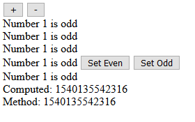

# 計算屬性

在模板中可以放入 JavaScript 表達式來做運算，在簡單的例子中很方便，但在真正開發時，會造成兩個問題:

* 在模板內寫表達式，會看到 HTML 內穿插著 JavaScript 的代碼，在可讀性上大打折扣。
* 如果單純用表達式的話，如果有復用的需求會造成在模板上重複寫多次相同的邏輯，降低可維護性。

今天介紹的計算屬性可以解決這些煩惱。

## 將模板內的表達式用計算屬性改寫

現在我們有下面這樣的代碼:

```js
var vm = new Vue({
  el: '#app',
  data: {
    number: 1
  }
});
```

```html
<div id="app">
  <button @click="number++">+</button>
  <button @click="number--">-</button>
  <div>
    <span>Number {{number}} is {{number % 2 === 0 ? 'even' : 'odd'}}</span>
  </div>
</div>
```

`{{number % 2 === 0 ? 'even' : 'odd'}}` 會判斷 `number` 是否是偶數，如果是的話輸出 `even` ，否的話則輸出 `odd` ，現在我們將它用 `computed` 改寫:

```js
var vm = new Vue({
  el: '#app',
  data: {
    number: 1
  },
  computed: {
    numberEvenOrOdd() {
      return this.number % 2 === 0 ? 'even' : 'odd';
    }
  }
});
```

```html
<div id="app">
  <button @click="number++">+</button>
  <button @click="number--">-</button>
  <div>
    <span>Number {{number}} is {{numberEvenOrOdd}}</span>
  </div>
</div>
```

這個例子說明了計算屬性的幾個特性:

* 在選項物件中以 `computed` 屬性設置。
* 每個對應的計算屬性都是一個具有回傳值且沒有傳入參數的 Function 。
* 在計算屬性的 Function 中的 `this` 會指向 Vue 實體，因此如果要使用 `this` 的話，則不能使用此種寫法 。
* 在模板中直接以 Function 名稱設置，不用加 `()` 。
* 可以從 Mustache 標籤中的引用方式得知，計算屬性跟一般的資料屬性一樣放於 Vue 實體中。

使用 `numberEvenOrOdd` 替代掉原本的表達式後，整個模板變得更加易讀，如果要在頁面上多個地方做設置，也只要重複使用 `numberEvenOrOdd` 變數就好了。

> 其實計算屬性可以用 arrow function 撰寫，下面會有詳細說明。

## 計算屬性特性說明

### 會跟著來源資料變化

一旦在 `computed` function 中參考到的資料有變化， 計算屬性就會跟著變化。

像是上節的例子，當 `number` 屬性變化時， `numberEvenOrOdd` 的值會在 `even` 及 `odd` 間跳動。

### 依然可以使用 arrow function

上面有說到**如果要使用 `this` 的話，則不能使用此種寫法** ，但其實 Vue 有提供計算屬性 arrow function 的寫法:

```js
var vm = new Vue({
  ...
  computed: {
    ...
    numberEvenOrOddArrow: vm => vm.number % 2 === 0 ? 'even' : 'odd'
  }
});
```

計算屬性的函數會傳入一個 `vm` 的參數，這個參數會是 Vue 的實體，也就是原本使用的 `this` ，因此可以使用 arrow function 寫計算屬性的代碼。

### 計算屬性也有 Setter

在前面的例子中計算屬性是一個 Function ，這個 Function 其實就是這個計算屬性的 Getter ，所以這樣的宣告方式只會有 Getter 可以配置，但 Vue 有提供計算屬性 Setter 的設置方式。

```js
var vm = new Vue({
  ...
  computed: {
    ...
    numberEvenOrOddSetter: {
      get() {
        return this.number % 2 === 0 ? 'even' : 'odd';
      },
      set(evenOrOdd) {
        if(this.number % 2 === 0){
          if(evenOrOdd !== 'even') this.number++;
          return;
        }
        if(evenOrOdd !== 'odd') this.number++;
      }
    }
  },
});
```

```html
<div id="app">
  ...
  <div>
    <span>Number {{number}} is {{numberEvenOrOddSetter}}</span>
    <button @click="numberEvenOrOddSetter='even'">Set Even</button>
    <button @click="numberEvenOrOddSetter='odd'">Set Odd</button>
  </div>
</div>
```

當按下 `Set Even`/`Set Odd` 時，如果 `number` 不是 Even/Odd ，則 `number` 會加一。

## 跟 mehods 的比較

其實計算屬性可以做的，方法也一樣可以做到，以上面的例子來說:

```js
var vm = new Vue({
  ...
  methods: {
    evenOrOdd(){
      return this.number % 2 === 0 ? 'even' : 'odd';
    }
  }
});
```

```html
<div id="app">
  ...
  <div>
    <span>Number {{number}} is {{evenOrOdd()}}</span>
  </div>
</div>
```

在模板上用 `evenOrOdd()` 執行方法後取回結果，跟計算屬性得到的值是相同的。

既然這樣為什麼還需要計算屬性呢? 在上節說明特性的第一點有提到**計算屬性會跟著來源資料變化**，其實更精確地說是**只**會跟著來源資料變化，看了下面的例子應該就了解了:

```js
var vm = new Vue({
  ...
  computed: {
    ...
    datePlusNumberComputed() {
      return Date.now();
    }
  },
  methods: {
    ...
    datePlusNumberMethod() {
      return Date.now();
    }
  }
});
```

```html
<div id="app">
  ...
  <div>
    <div>Computed: {{datePlusNumberComputed}}</div>
    <div>Method: {{datePlusNumberMethod()}}</div>
  </div>
</div>
```



可以看到 `datePlusNumberComputed` 因為在按了按鈕後並沒有任何跟此計算屬性有關的資料來源改變，所以它不會執行 Function 。

方法就不同了，只要每次重新渲染畫面就會執行一次。

如果這個回傳值跟資料來源的變化有關，那應該在來源有變化時在執行即可，否則會產生不必要的運算時間，降低效能，所以當要取得某個結果跟其他資料有關的值的話，用計算屬性才是上策。

## Demo

* [CodePen](https://codepen.io/peterhpchen/pen/vVrqQp)

## 小結

本文一開始介紹了計算屬性使用的方法，在 Vue 實體中以 `computed` 設置計算屬性，於模板上就可以像一般的資料屬性一樣做使用。

之後說明了計算屬性**會跟著來源資料變化**、**可以使用 arrow function** 以及**擁有 Setter** 的特性。

最後與 `methods` 做比較，得出如果想取得結果與某資料屬性有關則使用計算屬性的比較結果。

## 參考資料

* [Vue.js Guide: Computed Properties](https://vuejs.org/v2/guide/computed.html#Computed-Properties)
* [Vue.js API: computed](https://vuejs.org/v2/api/#computed)
