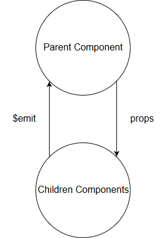
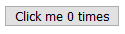
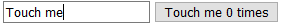
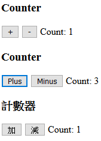

# 組件間的資料傳輸

父組件及子組件由於屬於不同的實體，不能直接在一個組件上使用另一個組件的方法或是修改資料，而是必須要使用 `props` 屬性及 `$emit` 方法來進行溝通。



子組件只要在 `props` 屬性加上需要由父組件傳入的參數定義，父組件就可以在配置子組件的時候給予子組件所需的參數屬性，而如果子組件因為變動需要通知父組件，就可以使用 `$emit` 通知父組件，而父組件只要設定相關事件的處理函數就可以接收到子組件的資料。

## 父組件使用屬性傳資料給子組件

在子組件使用 `props` 屬性註冊客製屬性，由父組件設定在子組件的屬性會變為實體中的屬性，如此一來就可以在子組件中使用由父組件傳來的資料。

跟前一篇一樣使用計算按鈕為例:

```js
Vue.component('button-counter', {
  template: `
    <button @click="count+=1">
      {{buttonName}} {{count}} times
    </button>
  `,
  props: ['buttonName'],
  data: function() {
    return {
      count: 0,
    };
  },
});
```

在 `props` 中設定 `buttonName` ，表示 `buttonName` 是一個客製屬性，會由父組件在設定模板時給予它的值。

接著設定父組件:

```html
<div id="app">
  <button-counter button-name="Click me"></button-counter>
</div>
```

```js
var vm = new Vue({
  el: '#app',
});
```

在父組件上以 kebab Case 設定客製屬性 `button-name` ，將它的值設為 `Click me` 。

接著我們可以看到結果如下圖:



也可以使用 `v-bind` 綁定資料屬性:

```js
var vm = new Vue({
  el: '#app',
  data: {
    buttonName: ''
  }
});
```

```html
<div>
  <input v-model='buttonName'>
  <button-counter :button-name="buttonName"></button-counter>
</div>
```



### 使用 `v-for` 帶入屬性

大部分的時候我們都會是有一包資料，這包資料中的每一筆都有多個屬性，因此想要在頁面上顯示這樣的資料時，可以使用組件跟 `v-for` 的組合來完成。

例如，我們需要有多個計數器，每個計數器會有**一個標題**及**一對加減按紐**:

```js
Vue.component('counter', {
  template: `
    <div>
      <h3>{{title}}</h3>
      <button @click="count+=1">{{plusBtnName}}</button>
      <button @click="count-=1">{{minusBtnName}}</button>
      Count: {{count}}
    <div>
  `,
  props: ['title', 'plusBtnName', 'minusBtnName'],
  data: function() {
    return {
      count: 0,
    };
  },
});
```

註冊 `counter` 組件，這個組件有三個 `props` 屬性: `title` 、 `plusBtnName` 及 `minusBtnName` 。

接著在 `new Vue` 實體上設定 `v-for` 要巡覽的資料:

```js
var vm = new Vue({
  el: '#app',
  data: {
    counters: [{        
      title: 'Counter',
      plusBtnName: '+',
      minusBtnName: '-'
    }, {
      title: 'Counter',
      plusBtnName: 'Plus',
      minusBtnName: 'Minus'
    }, {
      title: '計數器',
      plusBtnName: '加',
      minusBtnName: '減'
    }]
  }
});
```

接著在模板上配置 `v-for` 屬性渲染頁面:

```html
<div>
  <counter v-for="counter in counters"
           :title="counter.title"
           :plus-btn-name="counter.plusBtnName"
           :minus-btn-name="counter.minusBtnName"></counter>
</div>
```

這樣就可以完成設置了，結果如下圖:



### 減少傳入的屬性量

上例我們設定了三個屬性要傳入子組件中，可是它們都屬於 `counter` 資料物件，因此我們可以直接傳入 `coounter` 物件就好。

修改 `counter` 組件設置如下:

```js
Vue.component('counter-simple', {
  template: `
    <div>
      <h3>{{counter.title}}</h3>
      <button @click="count+=1">{{counter.plusBtnName}}</button>
      <button @click="count-=1">{{counter.minusBtnName}}</button>
      Count: {{count}}
    <div>
  `,
  props: ['counter'],   // 簡化為 counter 屬性
  data: function() {
    return {
      count: 0,
    };
  },
});
```

```html
<div>
  <counter-simple v-for="counter in counters"
                  :counter="counter"></counter-simple>
</div>
```

父組件只需要傳入 `counter` 屬性。

## 使用 `$emit` 反應子組件中的變化

當事件或是監聽器觸發時，子組件可以用 `$emit` 方法將變化反應給父組件知道。

還是以 `button-counter` 為例:

```js
Vue.component('button-counter', {
  template: `
    <button @click="clickPlus">
      {{buttonName}} {{count}} times
    </button>
  `,
  props: ['buttonName'],
  data: function() {
    return {
      count: 0,
    };
  },
  methods: {
    clickPlus: function() {
      this.count += 1;
      this.$emit('click-plus');
    }
  }
});
```

`click` 事件改為叫用 `clickPlus` 方法，這個方法做了兩件事:

* 將 `count` 加一。
* 叫用父組件的 `click-plus` 事件。

接著只要在父組件中的 `button-counter` 中設定 `click-plus` 事件的綁定就可以監看此事件:

```html
<div>
  {{count}}
  <button-counter button-name="Click me" @click-plus="count += 1"></button-counter>
</div>
```

如此一來我們就可以更新父組件內的 `count` 了。

### 將子組件中的資料傳給父組件

剛剛的例子有一個問題: 父組件的 `count` 並沒有跟 `button-counter` 中的 `count` 同步，為了解決這個問題，我們可以將 `button-counter` 內的 `count` 傳給父組件。

```js
methods: {
  clickPlus: function() {
    this.count += 1;
    this.$emit('click-plus', this.count);
  }
}
```

`$emit` 第二個參數傳入想要傳給父組件的資料，這裡是 `count` 。

接著在父組件中使用 `$event` 當作傳回的資料做處理:

```html
<button-counter button-name="Click me" @click-plus="count=$event"></button-counter>
```

如果使用方法名稱的方式設定客製事件，第一個參數就是傳入的資料:

```html
<button-counter button-name="Click me" @click-plus="clickPlus"></button-counter>
```

```js
methods: {
  clickPlus(count) {
    this.count = count
  }
}
```

如此一來就解決了同步的問題。

## 在組件上使用 `v-model`

在來複習 `v-model` ，它是雙向綁定的屬性，如下面的範例設定:

```html
<input v-model="inputSomething">
```

`v-model` 其實是 `value` 及 `@input` 的語法糖，也就是提供開發者叫簡潔的定義方式，所以他原本是:

```html
<input :value="inputSomething" @input="inputSomething=$event.target.value">
```

* 將 `value` 屬性的資料綁定到 DOM 元素上的 `value` 。
* `input` 事件觸發時將 `value` 的資料改為新的值。

因此要在客製的 `input` 組件上使用 `v-model` 的話，需要做下面三點設定:

* 傳入 `value` 客製屬性。
* 在目標 DOM 元素上將傳入的 `value` 客製屬性綁定到 DOM 元素上的 `value` 屬性。
* 在目標 DOM 元素更新資料，也就是觸發 `input` 事件的時候，使用 `$emit` 觸發上層的 `input` 事件，並帶入改變後的值。

```js
Vue.component('custom-input', {
  template: `
    <div>
      <h3>{{title}}</h3>
      <input :value="value"
             @input="$emit('input', $event.target.value)">
    <div>
  `,
  props: ['title', 'value'],
});
```

接著在父組件上的 `custom-input` 設定 `v-model` 屬性:

```html
<input v-model="inputSomething">
```

記住 `v-model` 是 `:value` 及 `@input` 的語法糖， `inputSomething` 會綁定 `value` 的值，並且會隨 `input` 事件所更新。

## DEMO

* [CodePen](https://codepen.io/peterhpchen/pen/zMxxwg)

## 結語

本文承接前一篇介紹的組件，更進一步的說明組件間的傳遞方式，上對下的是使用 `props` 屬性，下對上使用 `$emit` 方法，而最後透過已學習到的組件傳遞方式講述 `v-model` 在組件上如何使用。

到這章為止，基本的 Vue.js 使用方式已經有了較全面的了解，可以開始著手些一個小專案了，接下來我們將深入講解組件各式各樣的設定。

## 參考資料

* [Vue.js Guide: Components Basics](https://vuejs.org/v2/guide/components.html)
