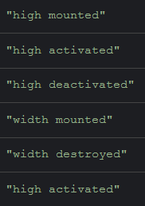
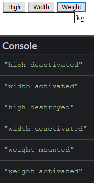

# 動態組件

前面在講組件基礎時有提到在 `<component>` 中加上 `is` 的屬性，綁定一個變數，這個 `<component>` 元素就會依照這個變數去尋找相同名字的組件渲染到頁面上。

如下面的例子所示:

```js
Vue.component('width', {
  template: `
    <div>
      <input>
      <span>m</span>
    </div>
  `
});

Vue.component('high', {
  template: `
    <div>
      <input>
      <span>m</span>
    </div>
  `
});

var vm = new Vue({
  el: '#app',
  data: {
    inputComponent: 'high'
  }
});
```

```html
<div id="app">
  <button @click="inputComponent='high'">High</button>
  <button @click="inputComponent='width'">Width</button>
  <component :is="inputComponent"></component>
</div>
```

這裡註冊了兩個組件: `high` 及 `width` ，而在父組件中使用 `<component :is="inputComponent">` 來設定組件目標要依照 `inputComponent` 的組件來渲染頁面。

如此一來在我們點擊不同的按鈕時， `<component>` 會因 `inputComponent` 的改變而渲染不同的組件。

## 會消失的組件狀態

上面的例子有一個問題，當你輸入了高度後切換到重量，再切回高度時，原本輸入的資料就會消失。

這是因為組件的每一次切換都會建立一個新的組件實體，這表示你切到重量時，高度的組件已經被銷毀，而切回來所看到的組件已經是一個全新的高度組件了。

這在大部分的組件使用情境中是適用的，因為你改變了要渲染的組件，代表之前的組件已經不需要使用了，而渲染出來的組件也需要是全新的狀態，不能殘留之前留下的資料，所以銷毀及重建組件的行為是合理的。

但像是需要反覆來回切換的組件就有可能會需要保留之前的值，例如有一個網頁是個問券，裡面有分好幾類，如果你填完了一類，之後想要在回去看之前填好的類別，這時如果資料狀態不能保留，勢必就會造成開發上的困擾。

## 建立永存的組件

`<keep-alive>` 標籤創造了一個區塊，這個區塊中所有的組件都不會銷毀。

我們將剛剛的例子加上 `<keep-alive>` :

```html
<keep-alive>
  <component :is="inputComponent"></component>
</keep-alive>
```

我們可以觀察再加上 `<keep-alive>` 後，切換組件時不會觸發 `destroyed` 鉤子函數，代表組件沒有被銷毀，所以高度及重量的數值在切換後都會被保留。

`<keep-alive>` 中也可以放一般的組件，下面的例子使用 `v-if` 判斷要使用哪個組件:

```html
<keep-alive>
  <high v-if="inputComponent==='high'"></high>
  <width v-else></width>
</keep-alive>
```

## `activated` 及 `deactivated` 鉤子函數

在 `<keep-alive>` 內的所有組件都會被加上 `activated` 及 `deactivated` 鉤子函數，他們觸發在組件啟用及休眠時。

在 `high` 中加上 `activated` 及 `deactivated` 鉤子函數:

```js
Vue.component('high', {
  template: `
    <div>
      <input>
      <span>m</span>
    </div>
  `,
  mounted: function() {
    console.log('high mounted');
  },
  destroyed: function() {
    console.log('high destroyed');
  },
  activated: function() {
    console.log('high activated');
  },
  deactivated: function() {
    console.log('high deactivated');
  }
});
```

可以看到一開始 `activated` 會被叫用，如果切換到 `width` 時就會叫用 `deactivated` 。

## `include` 及 `exclude` 屬性

在 `<keep-alive>` 上可以使用 `include` 屬性設定只有那些組件要做 cached ，而 `exclue` 則是設定那些組件不要做 cached 。

如下例所示:

```html
<keep-alive include="high">
  <component :is="inputComponent"></component>
</keep-alive>
```

這樣的設定表示只有 `high` 組件要 cached ，而 `width` 則不會被保存。

下圖是原本在 `high` ，然後切換到 `width` ，之後在切換回來的鉤子函數叫用的情形:



可以看到 `width` 在切換回 `high` 時已經被銷毀了。

如果要設定多個 `include` 組件的話可以使用**逗號分隔**組件名稱:

```html
<keep-alive include="high,width">
  <component :is="inputComponent"></component>
</keep-alive>
```

如此一來 `high` 及 `width` 組件都會包含了。

### 使用正規表達式設定

`include` 及 `exclude` 屬性除了直接寫出完整的名稱外，還可以使用**正規表達式**設定:

```html
<keep-alive :include="/high|width/">
  <component :is="inputComponent"></component>
</keep-alive>
```

使用正規表達式時記得因為不是直接綁定字串，所以要使用 `v-bind` 。

### 使用陣列設定

`include` 及 `exclude` 屬性還可以使用**陣列**設定:

```html
<keep-alive :include="['high']">
  <component :is="inputComponent"></component>
</keep-alive>
```

與正規表達式相同，因為不是字串所以要使用 `v-bind` 綁定。

## `max` 屬性

同時保留過多的組件會產生效能問題，為此 `max` 屬性可以設定最多要保留的組件數量。

```html
<keep-alive include="high,width,weight" max="2">
  <component :is="inputComponent"></component>
</keep-alive>
```

我們加上一個 `weight` 組件，接著看看切換時會如何運作:



依序按下 `Width` 及 `Weight` ，可以看到在按到 `Weight` 時因為組件數量超過 `2` ，所以在駐列中最前面(也就是最先被產生的)的 `high` 組件被銷毀了。

## DEMO

* [CodePen](https://codepen.io/peterhpchen/pen/GwjQwp)

## 結語

這章講述了 `<keep-alive>` 的功能及使用方式，它是確保組件在切換時不會被銷毀的標籤，可以使用 `include` 及 `exclued` 屬性設定特定組件的保留或是排除，也可以使用 `max` 屬性確保組件保留的數量。

## 參考資料

* [Vue.js Guide: `keep-alive` with Dynamic Components](https://vuejs.org/v2/guide/components-dynamic-async.html#keep-alive-with-Dynamic-Components)
* [Vue.js API: keep-alive](https://vuejs.org/v2/api/#keep-alive)
